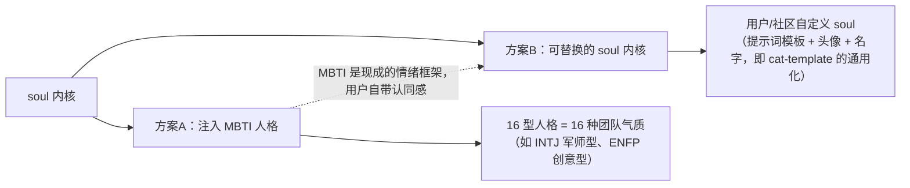
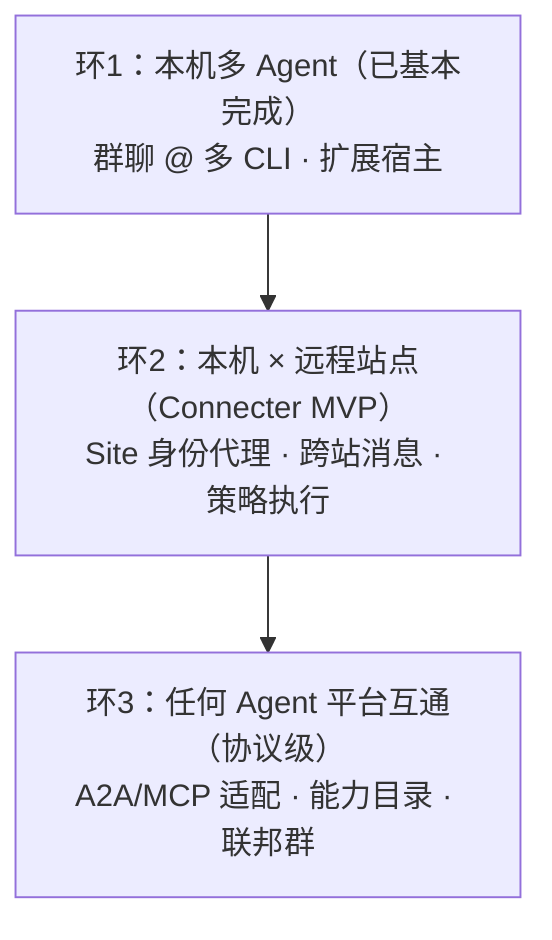
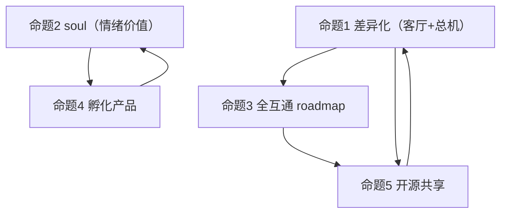

# 6 · 战略思考：和作者一起想的五个命题

> 本文是讨论稿：把 ohMyWorkPanel 与 clowder-ai 放在一起想清楚的问题——定义重复怎么破、soul 怎么给、全互通怎么走、孵化产品做什么、开源贡献怎么打。
> 结论是"建议方向"，不是仓库承诺；每个命题给 问题 → 分析 → 建议。

---

## 命题 1 · 和 clowder-ai 定义重复了？怎么打出 ohMyWorkPanel 的优势

**问题**：ohMyWorkPanel（本地面板 + 群聊 + 多 Agent）与 clowder-ai（本地平台 + 猫咖 + 团队）在"本地多 Agent 协作"上确实重叠。

**分析**：重叠的是"舞台"，不重叠的是"剧本"：
- clowder-ai 的护城河 = **身份与纪律**（跨模型互审、持久身份、记忆、SOP、猫人格）——它卖的是"团队怎么相处"；
- ohMyWorkPanel 的护城河 = **形态与轻量**（群聊界面、任务可见性、CLI 即插即用、扩展宿主）——它卖的是"上手就能用、用了看得见"。

所以优势不在"插件化 vs 协议化 vs Connecter"里三选一，而在**分层组合**：

| 层 | 打法 | 一句话 |
|----|------|--------|
| 界面层 | **插件化（扩展宿主）** | 让别人的能力（语音、Live、图表、甚至猫咖本身）以扩展形式长在面板里 |
| 协议层 | **协议化（A2A / MCP 适配）** | 与任何 Agent 平台讲同一种话，包括 clowder-ai 的 Cats |
| 网络层 | **workpanelConnecter** | 跨机器、跨站点、跨组织的"局域网"：中心化 Host + 站点自治 |

**建议**：ohMyWorkPanel 的差异化定位 = **"Agent 世界的客厅兼总机"**：客厅（面板/群聊）负责让人进来舒服，总机（协议 + Connecter）负责让 Agent 平台互相说话。不与 clowder-ai 抢"团队纪律"，而是做"谁都能住的开放平台"。具体动作：把 A2A/MCP 适配提升为一等公民（现状已有 A2A 白名单雏形），并让 Connecter 成为独立可交付的网络层产品（详见命题 3）。

## 命题 2 · 情绪价值付费 → 给 ohMyWorkPanel 一个 soul？

**问题**：猫咖证明"人愿意为情绪价值付费"。ohMyWorkPanel 要不要有自己的 soul？

**分析**：soul 的本质不是"毛茸茸"，而是**可被爱上的稳定人格**。猫咖 = 每只猫有名字/性格/分工，用户与"猫"建立长期关系。ohMyWorkPanel 现在没有这层，团队里只有"工作"没有"人"。

作者的两个候选方向都成立，且不互斥：

**建议**：
1. **先做方案 B 的内核，再预置方案 A 的首发皮肤**：实现"soul 配置文件"（名字/头像/性格提示词/偏好指令），由面板注入到每个 Agent 的上下文前缀；内置 2–3 套 MBTI 风格 soul 作为默认，社区可上传更多（正好接到 roadmap 的"Agent 角色社区模板"）。
2. soul 的注入点选"上下文前缀 + 群公告 + 成员卡片"，不动任务逻辑——**soul 是壳，不是电梯**，保证换 soul 不破坏任务语义。
3. 可行的第一步验证：做一个"MBTI 群组人格"实验群，看用户留存与使用频次是否有可测量差异。

## 命题 3 · 打通所有 Agent 平台（无视空间）→ 怎么建设 roadmap 与生态

**问题**：ohMyWorkPanel 的梦想是"打通所有 agent 和 agent 平台，无视空间"。这个梦想变成 roadmap 应该怎么排？

**分析**：把这个梦想拆成三个可交付的"越来越宽"的环：

**建议的 roadmap**：
| 阶段 | 内容 | 验收 |
|------|------|------|
| Q3-Q4'26 | 环2 落地：Connecter 双向打通（跨机命令/结果、身份映射、审计） | 两台真实机器跑通"远程 Agent 干活、本地群里看结果" |
| Q4'26-Q1'27 | 环3 协议层：A2A `tasks/send` 服务器面 + MCP 客户端 | 外部 Agent（如 Clowder Cats）无需改核心即可入群 |
| 贯穿 | 生态三件套：扩展市场（贡献点商店化）、soul 模板库、能力目录开放 | 第三方贡献数 > 5 |

生态不是造出来的，是"让人在生态里赚钱/省事"长出来的：先让**贡献点**（页签/右栏/消息动作）有文档和示例，再让**soul/角色**可交易，最后让**站点**可连接。

## 命题 4 · 需要一个成功的孵化产品

**问题**：平台需要"用 ohMyWorkPanel 真正做出一款内容产品"来证明自己。

**分析**：平台型产品最常见的死法 = "什么都准备好了，但没人用它产出一件东西"。孵化产品的选择标准：
1. **必须是内容/作品级产出**（不是工具演示）；
2. **必须天然是"多 Agent + 群聊"的形态**（否则不需要这个平台）；
3. **产出物可以对外**（Post/文档/游戏/教程，能传播）。

**建议的三个候选方向**（按投入排序）：

| 方向 | 是什么 | 为什么是它 |
|------|--------|-----------|
| A. AI 协作文档/调研连载 | 用 Codex+Claude+Cursor 分工（调研/写作/制图/校对），群里 @ 协作产出一系列深度文章 | 成本最低，直接复用本次"知识飞轮"与调研类工作流；产出即是最好的宣传 |
| B. 主题/皮肤商店首发 | 把 v2.1 的七主题做成"第一件可售卖的扩展"：主题商城 + 用户自创主题上传 | 题材自带传播性（好看=easy share），验证"情绪价值交易"的闭环 |
| C. 多 Agent 游戏/互动剧本 | 用 Ask 模式 + Wave 做桌游/剧本杀式群活动（AI 酒馆已在 ECS 灰度群试运行过） | 情绪价值天花板最高，直接对标猫咖的"陪伴经济" |

**建议**：先做 A（快速、可公开、服务知识品牌），用 B 验证商业化闭环，C 作为 soul 命题 2 的天然实验场。

## 命题 5 · 开源共享：bugFix / issue / 集成 dsh

**问题**：作者想通过 ohMyWorkPanel 参与公共开源生态，甚至被集成进主流 Agent 工具（如 dsh）。怎么做？

**分析**：开源共享的优先级应该是"**先成为生态的贡献者，再成为生态的平台**"：

| 动作 | 具体做法 | 收益 |
|------|---------|------|
| 1. 对知名仓库提建设性 issue/bugFix | 挑与本项目技术栈相关且我们真的用过的仓库（如我们深度使用的 A2A、MCP、各类 CLI 适配器、element-plus 类型的 UI 库，以及 dsh 本身），提交真实 bug/文档修复 | 建立信誉、反向了解大项目协作方式 |
| 2. 集成主流 Agent 工具 | **把 ohMyWorkPanel 变成 dsh 的宿主/面板**：DSH 自举运行时（轨道 G）就是为此设计的——做一个"dsh 插件/适配器，让 dsh 会话能进 ohMyWorkPanel 群" | 借 dsh 的用户群获得初始采用 |
| 3. 把自己的扩展开源分仓 | 把 PanelLive、主题、soul 模板等做成独立开源仓库，main 仓只进核心 | 生态"可勾选"而非"必须打包" |
| 4. 对外先说清边界 | 安全口径（本地执行、密钥加密、恢复由用户负责）写进 README/SECURITY | 消除“开源 AI 工具不敢用”的最大疑虑 |

**一个已经发生的事实**：本知识库生态里，我们已经把"知识飞轮 MVP"做成 DSH 的动态插件（`endlessWpKnowledgeRunner/dsh/fw-plugin.js`），并在 DSH 上验证了 HTTP 检索端点——这就是"项目被集成进主流 Agent 工具"的最小样本，ohMyWorkPanel 的 DSH 宿主可以复用同一思路。

---

## 附：五个命题的关系

一句话收束：**先做看得见的客厅（命题1/5），再养活得起的灵魂（命题2/4），最后织通全世界的网（命题3）。**