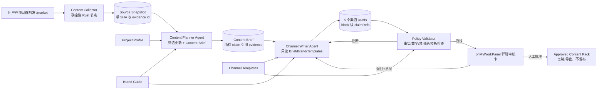

# ohMyWorkPanel “自宣传 / Self-Marketing” MVP 架构评估

## 1. 结论先行

**值得做，而且与 ohMyWorkPanel 的当前产品定位和架构高度匹配。**

它不是一个需要另起炉灶的营销 SaaS，而是 ohMyWorkPanel 已有“项目工作区 + 多 Agent + 群聊协作 + 人工审批”能力的自然纵向 Use Case：把开发事实整理成可审阅的内容包。

建议把它放入“轨道 A：工作群”的一个新业务域，暂名 **Self-Marketing / Content Campaign**。MVP 只完成以下闭环：

1. 人工在项目群触发一次内容生成；
2. 后端确定性采集 README、CHANGELOG、Git 范围、diff、变更 docs，以及可用时的 merged PR；
3. Planner 从事实快照中筛选值得宣传的变化，并输出结构化 Content Brief；
4. Writer 只基于 Brief、Brand Guide 和 Channel Template，一次生成五个渠道草稿；
5. 规则审校器检查事实引用、禁用语、数字、夸张比较和渠道约束；
6. 草稿包回到原群聊，等待用户批准或退回修改；
7. 用户复制或导出 Markdown，**不自动发布**。

MVP 不做定时任务、平台登录、自动发布、数据回流、素材生成、A/B 测试、多品牌管理，也不引入新的通用工作流引擎。

## 2. 研究对象与证据边界

### 2.1 仓库快照

- 本地源码检出：`D:\AI\LinlisWorkPanel`，commit `cfef082d7a9e5d434777374bd6b99ef8cd309cfc`，分支 `bugfix/v2.1.2`，调研时工作区干净。
- GitHub 当前 `main`：commit `b1af2659aea5068643729ee995bb944bf27b7a37`。
- 两者之间的主要差异是 PR #16 的目录领域化和 AI contribution harness。PR 明确保留 Tauri IPC、Web API、SQLite schema 与运行时契约；本报告引用的调度、上下文、群聊和审批核心逻辑未被该 PR 改写。
- 当前 GitHub 最新 Release 为 `v2.1.2`；Release 页面记录了桌面更新、Windows 工作区、主题和灰度验证结果。

### 2.2 主要证据

本地源码证据均以 `cfef082` 为基线：

| 事实 | 源码证据 |
|---|---|
| 群绑定服务器绝对工作区，Agent 在该工作区运行 | `src-tauri/src/memory.rs:98-135`；`src-tauri/src/scheduler.rs:697-727` |
| prompt 已注入群公告、epitaph、记忆、Wiki、经验与最近聊天 | `src-tauri/src/scheduler.rs:402-482` |
| 消息中 @Agent 会创建 `task_runs` 并进入群调度 | `src-tauri/src/commands.rs:463-603` |
| Agent 输出可继续 @ 其他 Agent，形成有深度限制的 A2A 子 run | `src-tauri/src/scheduler.rs:1241-1296` |
| 已有 Reviewer run、`awaiting_review`、批准/拒绝和前端按钮 | `src-tauri/src/scheduler.rs:1102-1185`；`src-tauri/src/commands.rs:1001-1050`；`src/components/furniture.tsx:341-384` |
| SQLite 已保存 groups、messages、task_runs、run_events、attachments | `src-tauri/src/db.rs:103-158` |
| 已有 Git tags、HEAD 和最近 20 条 commit subject 的只读采集 | `src-tauri/src/git_inspect.rs:1-237` |
| 已有版本、Ask、Wave、awaiting_release 工作流 | `src-tauri/src/workflow.rs:1-124,445-650` |
| 现有 roadmap orchestration 已证明“状态记录 + 串行 task run + terminal hook”的做法 | `src-tauri/src/orchestrator.rs:1-228` |

外部证据：

- [ohMyWorkPanel GitHub 仓库](https://github.com/linlisWorkTeam/ohMyWorkPanel)
- [PR #16：目录领域化与 AI Harness](https://github.com/linlisWorkTeam/ohMyWorkPanel/pull/16)
- [v2.1.2 Release](https://github.com/linlisWorkTeam/ohMyWorkPanel/releases/tag/v2.1.2)
- [GitHub REST：commits / compare](https://docs.github.com/en/rest/commits)
- [GitHub REST：pull requests](https://docs.github.com/en/rest/pulls)
- [GitHub REST：releases](https://docs.github.com/en/rest/releases)
- [GitHub Webhooks](https://docs.github.com/en/webhooks/about-webhooks)

### 2.3 证据边界

- 本报告是架构研究与实施建议，不代表功能已实现。
- 本地 `git_inspect.rs` 目前只读 tag、HEAD 与 commit subject，**尚未**采集 README/CHANGELOG、完整 diff、PR body/files 或可引用的证据片段。
- PR 信息不是纯本地 Git 必然具备的数据。MVP 应把 GitHub/`gh` 作为可选 Provider；不可用时明确显示 `unavailable`，不得让模型补猜。
- 当前 Reviewer 协议主要面向 Agent 审查；Self-Marketing 的最终审批应由人类完成，不能由 Reviewer Agent 自动把 campaign 标记为可发布。

## 3. 为什么与现有架构匹配

### 3.1 产品匹配

ohMyWorkPanel 的核心不是某个模型，而是“项目上下文中的 Agent 协作”。Self-Marketing 仍然发生在同一个项目工作区内：

- 输入是项目事实；
- 执行者是群内 Agent；
- 编排发生在 task run；
- 结果回到群聊；
- 用户做最终决策。

因此它增强了工作群，不需要把产品变成内容管理或社媒运营平台。

### 3.2 技术匹配

现有能力与新流程的映射如下：

| Self-Marketing 需求 | 可复用能力 | 缺口 |
|---|---|---|
| 绑定项目 | `Group.workspace_path` | 无 |
| 读取仓库 | CLI Agent cwd、`git_inspect` | 缺确定性 Source Snapshot |
| 多角色协作 | group members、@mentions、A2A、parent run | 缺 campaign 阶段状态 |
| 生成内容 | Codex/Claude/OpenCode/Cursor 等 adapter | 缺结构化 brief/output contract |
| 群聊审核 | messages、run status、review buttons | 缺 campaign 审批语义与意见 |
| 审计 | run_events、logs、message parts | 缺 claim→evidence 映射 |
| 稳定复跑 | SQLite、run 恢复、串行调度 | 缺 generation key 与版本化模板 |
| GitHub PR/Release | 暂无正式 Provider | 需可选 GitHub Context Provider |

### 3.3 不应错误复用的部分

- **不要只靠 Agent 自己 `git log` 后直接写五篇文案。** 这会把事实选择、事实核对和文风生成混在一次不可审计推理里。
- **不要把 Wiki 当项目事实源。** Wiki 适合共享规则和背景，最近变更应来自固定 commit 范围和文件快照。
- **不要把 Project Version/Wave 直接改名成 Campaign。** 二者生命周期、状态和产物不同；可借鉴其状态机与 UI，但不复用表。
- **不要把 Roadmap Orchestrator 泛化成 DAG 引擎。** MVP 只有固定的 4–5 个阶段，新建一个窄的 `marketing::CampaignService` 更容易验证。
- **不要让现有 Agent Reviewer 自动批准对外内容。** 它可给建议，但最终状态必须由人类操作。

## 4. MVP 总体架构



关键设计是把 LLM 放在两个“智能节点”里，把事实采集、状态转换、校验和审批留给确定性代码。

## 5. Agent、Skill 与 Node 的最小设计

### 5.1 是否需要 Planner、Writer、Reviewer

需要的是**逻辑职责分离**，不是三个常驻、自治、互相聊天的 Agent。

MVP 推荐：

| 角色 | 形态 | 原因 |
|---|---|---|
| Context Collector | 确定性 Node，不是 Agent | 固定命令、固定范围、可复现、可限制大小 |
| Content Planner | 新预设 Agent | 负责价值判断、角度和 brief，不写渠道成稿 |
| Channel Writer | 新预设 Agent | 一次批量生成全部渠道；只允许使用 brief 中的 claim |
| Reviewer | 确定性 Policy Node + 人类 | 规则能程序化就不交给 LLM；人类是最终批准者 |
| Editorial Reviewer Agent | P1 可选 | 只做语气、可读性和跨渠道一致性建议，不改变事实或批准状态 |

这样 MVP 只新增两个 Agent preset，不新增五个渠道 Writer，也不要求独立 Reviewer Agent。

### 5.2 Skill

新增一个可版本化 Skill：`self-marketing`。它约束 Planner/Writer 的输入输出，不负责运行时编排。

建议 Skill 内容：

- `SKILL.md`：阶段职责、禁止事项、JSON contract、失败处理；
- `references/brief-schema.md`：Content Brief 字段；
- `references/claim-policy.md`：事实、数字、比较级、限制项规则；
- `templates/channels/*.md`：产品内置渠道模板；
- `examples/`：小型 golden fixtures，不放真实密钥和内部仓库内容。

如果未来 CLI adapter manifest 支持为成员挂载 skills，使用该机制；MVP 也可先由 CampaignService 将版本化规则拼入 prompt，避免阻塞在新的通用 Skill Runtime 上。

### 5.3 固定 Node

MVP 固定五步：

1. `collect_context`
2. `plan_brief`
3. `write_drafts`
4. `validate_drafts`
5. `await_human_review`

允许的边只有：

- collector 失败 → `failed`；
- planner 判断无值得宣传更新 → `no_content`；
- writer/schema 失败 → 同阶段最多重试一次；
- validator 阻断 → writer 修改，最多两轮；
- 用户退回 → writer 修改；
- 用户批准 → `approved`。

这里不需要 LangGraph/Temporal。现有 task run、SQLite 状态、terminal callback 和启动恢复模式已经够用。

## 6. Project Context、Brand Guide 与 Channel Template

### 6.1 三者边界

| 对象 | 生命周期 | 内容 | 不应包含 |
|---|---|---|---|
| Project Profile | 长期、人工维护 | 产品定位、用户、成熟度、核心能力、已知限制、术语 | 最近 commit 细节 |
| Source Snapshot | 每次 campaign 生成 | base/head、README、CHANGELOG、commits、PR、diff、changed docs、evidence | 品牌语气和渠道格式 |
| Brand Guide | 长期、人工维护 | 品牌人格、语气、术语、禁用词、主张边界、CTA 偏好 | 渠道长度硬编码 |
| Channel Template | 版本化 | 渠道结构、段落、格式、标题策略、标签策略、校验规则 | 新的项目事实 |
| Content Brief | 每次 campaign 生成 | 选题、受众、主张、证据、限制、渠道目标 | 没有 evidence 的事实 |

### 6.2 项目内配置目录

推荐允许项目显式提交以下配置：

```text
docs/marketing/
├── project-profile.md
├── brand-guide.md
└── channels/
    ├── x.md
    ├── xiaohongshu.md
    ├── zhihu.md
    ├── bilibili-script.md
    └── github-release.md
```

读取优先级：

1. 项目 `docs/marketing/channels/<channel>.md`；
2. 项目 `brand-guide.md` 中的 channel override；
3. ohMyWorkPanel 内置模板。

运行状态不放进 Git；SQLite 是 campaign 的 SSOT。用户选择“导出证据包”时，可只写入已被 `.gitignore` 忽略的：

```text
.ohmyworkpanel/marketing/exports/<campaign-id>/
├── source-snapshot.json
├── content-brief.json
├── drafts.json
└── review-report.json
```

导出目录只用于审计与搬运，不能反向覆盖 SQLite 状态。

### 6.3 Brand Guide 最小字段

```yaml
brandName: ohMyWorkPanel
voice:
  traits: [具体, 克制, 开发者友好, 不装懂]
  avoid: [营销腔, 夸张比较, 空洞愿景, 伪造数字]
terminology:
  preferred:
    multi-agent: 多 Agent
    workspace: 工作区
  forbiddenClaims:
    - 业界第一
    - 彻底解决
    - 零成本
defaultCta: 欢迎查看仓库、试用并提交反馈
disclosureRules:
  - 实验性功能必须注明实验性
  - 未上生产不得写已上线
```

### 6.4 Channel Template 最小字段

```yaml
id: x-thread-default
channel: x
version: 1
language: zh-CN
goal: 产品更新说明
structure:
  - hook
  - user_problem
  - what_changed
  - proof_or_limit
  - cta
constraints:
  maxPosts: 5
  requireEvidencePerClaim: true
  allowEmoji: limited
  allowHashtags: true
style:
  defaultTone: developer-log
  bannedPhrases: [重磅, 颠覆, 史诗级, 革命性, 遥遥领先, 一站式赋能]
```

渠道规则会变化，因此不要把外部平台限制散落在 prompt；集中在带版本号的模板中，并允许更新。

## 7. 事实采集与“是否值得宣传”的判断

### 7.1 默认采集范围

默认 baseline：

1. 最近一次已经批准过 campaign 的 `headSha`；
2. 没有历史 campaign 时，最近真实 Git tag；
3. 没有 tag 时，最近 N 条 commit，N 默认 20；
4. 用户可以显式选择 tag、commit 或日期范围。

默认只宣传已提交内容。检测到 working tree dirty 时：

- 页面显示 dirty warning；
- 不把 uncommitted diff 纳入事实源；
- 只有用户明确勾选“包含未提交变更”才允许采集，并在所有草稿中标记“开发中/尚未发布”。

### 7.2 Source Snapshot 内容

- `README.md`、`README.*`；
- `CHANGELOG.md` 的 Unreleased 与目标版本段；
- `base..head` commit metadata；
- `base...head` name-status 与有大小上限的 textual diff；
- 范围内新增/修改的 `docs/**/*.md`；
- Git tag、release 元数据；
- GitHub Provider 可用时，与 commit 范围关联的 merged PR title/body/labels/files/url；
- 数据缺失、截断、二进制文件、冲突来源清单。

所有源都生成 `EvidenceRef`，包含 SHA、locator、内容 hash 和采集时间。

### 7.3 GitHub Provider

MVP 本地优先：

- Git 事实始终可用；
- public GitHub 仓库可用未认证 REST；
- private 仓库优先使用已经登录的 `gh`；
- 不把 token 写入 campaign、log 或 prompt；
- Provider 不可用时返回 `status=unavailable`，campaign 仍可基于本地 Git 继续；
- PR 不是必填事实源，不能因 PR 缺失阻止本地项目生成内容。

GitHub 官方 Compare API 可返回 commits 和 changed files；PR 与 Release 也有独立 REST API。未来自动触发可使用 `push`、`pull_request`、`release` webhook，但 MVP 不接 webhook。

### 7.4 值得宣传评分

Planner 对每个候选更新使用固定 rubric：

| 维度 | 分值 | 含义 |
|---|---:|---|
| User impact | 0–3 | 用户能否感知，是否解决实际问题 |
| Proof strength | 0–3 | 是否有代码、测试、Release、截图或文档证据 |
| Novelty | 0–2 | 是否为新能力或显著变化，而非内部整理 |
| Timeliness | 0–1 | 是否属于本轮发布或近期节点 |
| Channel fit | 0–1 | 是否有清晰的外部表达角度 |
| Risk penalty | 0–5 | 未验证、仅计划、破坏性、敏感或易误导 |

建议阈值：`total >= 6` 且 `proofStrength >= 2`。低于阈值时不生成五渠道草稿，只在群聊说明“本轮没有足够值得宣传且证据充分的更新”。

这个“允许不产出”的分支是避免 AI 营销腔的关键。

## 8. Core State Schema

MVP 使用一张 additive SQLite 表 `content_campaigns`，JSON 列保存版本化业务对象，避免过早拆出十几张表：

```sql
CREATE TABLE content_campaigns (
  id TEXT PRIMARY KEY,
  group_id TEXT NOT NULL REFERENCES groups(id) ON DELETE CASCADE,
  root_message_id TEXT NOT NULL REFERENCES messages(id),
  status TEXT NOT NULL,
  baseline_ref TEXT,
  source_head_sha TEXT,
  channels_json TEXT NOT NULL,
  snapshot_json TEXT,
  brief_json TEXT,
  drafts_json TEXT,
  review_json TEXT,
  planner_run_id TEXT,
  writer_run_id TEXT,
  approved_by_member_id TEXT,
  approved_at INTEGER,
  created_at INTEGER NOT NULL,
  updated_at INTEGER NOT NULL
);

CREATE INDEX idx_content_campaigns_group_updated
  ON content_campaigns(group_id, updated_at DESC);
```

状态 JSON 的逻辑 schema：

```json
{
  "schemaVersion": 1,
  "id": "campaign-uuid",
  "groupId": "group-uuid",
  "status": "collecting|planning|writing|validating|awaiting_user|changes_requested|approved|no_content|failed",
  "request": {
    "baseline": "last_marketed|last_release|tag:v2.1.1|sha:...",
    "channels": ["xiaohongshu", "x", "zhihu", "bilibili_script", "github_release"],
    "includeWorkingTree": false,
    "language": "zh-CN"
  },
  "snapshot": {
    "repository": {
      "root": "not_exposed_to_writer",
      "baseSha": "...",
      "headSha": "...",
      "dirty": false,
      "capturedAt": "2026-09-01T00:00:00Z",
      "snapshotHash": "sha256:..."
    },
    "sources": [
      {
        "id": "E1",
        "type": "readme|changelog|commit|pr|diff|doc|release|test_evidence",
        "locator": "CHANGELOG.md#2.1.2",
        "revision": "blob-sha-or-url",
        "excerpt": "...",
        "contentHash": "sha256:...",
        "truncated": false
      }
    ],
    "providerStatus": {
      "git": "ok",
      "github": "ok|unavailable|partial"
    },
    "warnings": []
  },
  "brief": {},
  "drafts": [],
  "review": {
    "status": "pending|passed|blocked",
    "blockingIssues": [],
    "warnings": [],
    "unsupportedClaimIds": [],
    "styleViolations": []
  },
  "runs": {
    "plannerRunId": "...",
    "writerRunId": "...",
    "iteration": 1,
    "generationKey": "sha256:...",
    "promptVersion": "self-marketing-v1"
  },
  "approval": {
    "decision": "pending|approved|changes_requested",
    "memberId": null,
    "comment": null,
    "decidedAt": null
  },
  "createdAt": 0,
  "updatedAt": 0
}
```

`generationKey` 建议由以下内容计算：

```text
snapshotHash
+ projectProfileHash
+ brandGuideHash
+ channelTemplateHashes
+ promptVersion
+ modelConfigHash
+ iterationPurpose
```

同 key 的成功结果优先复用，避免恢复或误点造成重复模型调用和草稿漂移。

## 9. Content Brief Schema

```json
{
  "schemaVersion": 1,
  "campaignId": "campaign-uuid",
  "workingTitle": "ohMyWorkPanel v2.1.2：桌面更新与主题基础设施",
  "campaignType": "release|milestone|feature|engineering_story|no_content",
  "audience": [
    {
      "segment": "本地使用 Coding Agent 的开发者",
      "need": "希望统一查看多 Agent 协作和运行状态"
    }
  ],
  "angle": "一次具体、可验证的产品更新，而不是泛泛介绍多 Agent 愿景",
  "oneSentenceMessage": "本轮把桌面更新、Windows 工作区和主题响应式基础补齐。",
  "noteworthyChanges": [
    {
      "id": "N1",
      "title": "桌面更新流程",
      "userValue": "用户可检查、校验并交接安装包更新",
      "score": {
        "userImpact": 3,
        "proofStrength": 3,
        "novelty": 2,
        "timeliness": 1,
        "channelFit": 1,
        "riskPenalty": 0,
        "total": 10
      },
      "claimIds": ["C1", "C2"]
    }
  ],
  "claims": [
    {
      "id": "C1",
      "text": "v2.1.2 增加桌面更新检查与 SHA-256 下载校验。",
      "evidenceRefs": ["E3", "E7"],
      "confidence": "high",
      "allowedParaphrases": [
        "桌面端现在可以检查更新并校验下载文件"
      ],
      "prohibitedExtensions": [
        "自动无感升级",
        "绝对安全"
      ]
    }
  ],
  "limitations": [
    {
      "text": "安装包尚未代码签名，SmartScreen 可能提示未知发布者。",
      "evidenceRefs": ["E8"],
      "requiredForChannels": ["github_release"]
    }
  ],
  "openQuestions": [],
  "doNotSay": [
    "业界领先",
    "颠覆多 Agent 协作",
    "生产环境已经自动升级"
  ],
  "callToAction": "查看 Release、下载试用并反馈问题",
  "channelIntents": {
    "xiaohongshu": "开发者产品更新笔记",
    "x": "简短 release thread",
    "zhihu": "问题—设计—证据—限制的解释文",
    "bilibili_script": "60–90 秒演示脚本",
    "github_release": "准确、可扫描、包含限制的发布说明"
  }
}
```

关键不变量：

1. `claims[*].evidenceRefs` 非空；
2. Writer 不得创建新 claim，只能引用 `claimIds`；
3. 数字、版本、状态、兼容性、性能和比较级必须有证据；
4. `openQuestions` 非空且影响主张时，campaign 不能进入 writing；
5. `campaignType=no_content` 时 drafts 必须为空。

## 10. Draft Schema 与校验

Writer 输出结构化 blocks，而不是一坨 Markdown：

```json
{
  "channel": "x",
  "templateId": "x-thread-default",
  "templateVersion": 1,
  "blocks": [
    {
      "kind": "hook",
      "text": "ohMyWorkPanel v2.1.2 更像一次基础设施补课。",
      "claimRefs": []
    },
    {
      "kind": "claim",
      "text": "桌面端新增更新检查和 SHA-256 下载校验。",
      "claimRefs": ["C1"]
    },
    {
      "kind": "limitation",
      "text": "安装包尚未代码签名，Windows 可能提示未知发布者。",
      "claimRefs": ["C4"]
    }
  ],
  "renderedText": "...",
  "warnings": []
}
```

Validator 至少执行：

- JSON schema 校验；
- 所有 `claimRefs` 必须存在；
- claim block 不允许空引用；
- 数字/版本号必须出现在已引用 claim 或模板常量中；
- `bannedPhrases` 扫描；
- 无证据的最高级、绝对化、效果比较扫描；
- required limitation 是否出现；
- 渠道结构和段数检查；
- GitHub Release 必须包含 breaking/limitations/verification 状态；
- 五个渠道的核心 one-sentence message 不得相互矛盾。

规则扫描不可能完全理解自然语言，但它能阻止最常见、最昂贵的错误；剩余语义风险由群聊人工审批承担。

## 11. 如何保证事实、风格与稳定性

### 11.1 事实一致性

采用“证据先于文案”：

1. Collector 冻结 commit 范围与源文件 hash；
2. Planner 只能从 snapshot 建 claim；
3. Writer 只读 brief，不读完整 raw diff；
4. 每个事实 block 携带 claim refs；
5. Validator 检查 claim coverage；
6. UI 能展开“这句话来自哪里”；
7. 用户批准的是某个固定 `snapshotHash + draftsHash`，批准后修改必须产生新 revision。

### 11.2 风格一致性

- Brand Guide 只存稳定品牌规则；
- 渠道差异只在 Channel Template；
- 所有渠道从同一个 Brief 生成；
- 一个 Writer run 批量生成五个渠道，避免五个 Agent 各自发明主题；
- prompt、模板和 brand guide 都有版本/hash；
- 建立 3–5 个固定 fixture 的 golden tests，检查结构、禁用词、claim coverage，不锁死全文措辞。

### 11.3 运行稳定性

- Source Snapshot 有总字符/文件/PR 数上限；超限按可解释规则截断；
- Collector 使用固定参数直接调用 `git`/`gh`，禁止 `sh -c`；
- LLM 输出 schema 不合法时最多修复一次；
- validator 循环最多两次，超过后转人工；
- generation key 防重复；
- campaign 状态每一步先落 SQLite，再触发下一个 run；
- 应用启动时把 `planning|writing|validating` 的 campaign 标为 interrupted，再由用户或安全恢复逻辑继续；
- 外部 GitHub Provider fail-open，但必须在 UI 显示缺失来源。

## 12. 如何避免 AI 营销腔和夸大宣传

默认写作人格应是“开发者更新日志”，不是“品牌发布会”。具体规则：

1. 允许输出“没有值得宣传的更新”；
2. 开头优先具体变化或用户问题，不写“在数字化浪潮下”；
3. 禁用“重磅、颠覆、革命性、史诗级、遥遥领先、重新定义、一站式赋能”等默认词；
4. 不写未出现于证据的用户数、效率提升、性能比例和市场排名；
5. 不把代码合并写成“已上线”，除非 Release/部署证据明确；
6. 不把 roadmap、TODO、draft spec 写成已交付；
7. 对实验性、未签名、未上生产、仅灰度等限制主动保留；
8. 描述“做了什么、谁会受益、证据是什么、还有什么限制”；
9. 渠道可以有不同语气，但不能有不同事实；
10. 用户退回时优先局部改稿，不重新生成全部 brief。

## 13. 典型用户交互

### 13.1 最短流程

用户在项目群输入：

```text
/market since:last-release channels:x,xiaohongshu,zhihu,bilibili,github-release
```

系统先回一条范围卡：

```text
准备生成宣传草稿
范围：v2.1.1..b1af265
工作区：clean
本地 Git：可用
GitHub PR：可用，关联 2 个 merged PR
将读取：README、CHANGELOG、12 commits、2 PR、18 changed files、6 docs
```

随后群聊出现 Content Brief 摘要：

```text
判断：有 2 项值得宣传
主角度：桌面更新与 Windows 使用体验补齐
证据强度：高
必须说明：安装包未签名；本次 Release 未切换生产
```

生成完成后出现五渠道草稿与审校摘要：

```text
事实覆盖：12/12 claims 有证据
阻断问题：0
警告：X thread 第 1 条偏长；知乎标题可再具体

[小红书] [X] [知乎] [B站脚本] [GitHub Release]
[展开证据] [要求修改] [批准内容包]
```

用户可以：

- “把小红书开头改得像开发日志，去掉情绪词”；
- “知乎只保留桌面更新，不谈主题”；
- “GitHub Release 保留 SmartScreen 限制”；
- 点击批准；
- 复制单渠道或导出全部 Markdown。

### 13.2 无内容分支

如果最近只有依赖升级、格式化或无用户影响的内部重构：

```text
本轮没有生成宣传草稿。
原因：候选更新最高分 4/10，缺少明确用户影响或发布证据。
你仍可选择“按工程日志生成”，但系统不会把它包装成产品发布。
```

## 14. 建议代码目录

基于当前 `main` 的领域化规则，新增清晰的 `marketing` 产品域：

```text
src/
└── marketing/
    ├── CampaignReviewCard.tsx
    ├── CampaignDraftTabs.tsx
    ├── campaignApi.ts
    ├── campaignTypes.ts
    ├── campaignPolicy.ts
    └── campaignPolicy.test.ts

src-tauri/src/
└── marketing/
    ├── mod.rs
    ├── models.rs
    ├── repository.rs
    ├── context_collector.rs
    ├── github_provider.rs
    ├── prompts.rs
    ├── validator.rs
    ├── service.rs
    └── tests.rs

src-tauri/resources/
└── marketing/
    ├── self-marketing-skill/
    │   ├── SKILL.md
    │   └── references/
    └── channels/
        ├── x.md
        ├── xiaohongshu.md
        ├── zhihu.md
        ├── bilibili-script.md
        └── github-release.md

docs/
├── how-to/generate-self-marketing-content.md
└── reference/self-marketing.md
```

入口文件保持薄：

- `lib.rs` 只声明/re-export `marketing`；
- `commands.rs` 只做 Tauri 参数适配；
- `web.rs` 只注册 Web routes；
- `scheduler.rs` 只在 terminal path 调用 `marketing::on_run_terminal`；
- 领域状态转换、prompt、校验和 DB 访问全部在 `marketing/` 内。

## 15. 需要修改的核心模块

### P0 必改

| 模块 | 修改 |
|---|---|
| `src-tauri/src/db_migrations.rs` | 新增 additive `content_campaigns` migration 与契约测试 |
| `src-tauri/src/marketing/context_collector.rs` | 固定范围读取 Git、README、CHANGELOG、diff、docs；生成 EvidenceRef |
| `src-tauri/src/marketing/github_provider.rs` | 可选 PR/Release 元数据，fail-open、不泄露 token |
| `src-tauri/src/marketing/service.rs` | campaign 状态机、generation key、run 串联、人工审批 |
| `src-tauri/src/marketing/validator.rs` | schema、claim coverage、数字、禁用词、限制项与渠道规则 |
| `src-tauri/src/scheduler.rs` | run terminal 后通知 CampaignService；不把营销逻辑写进 scheduler |
| `src-tauri/src/commands.rs` / `web.rs` | 新增不破坏原 API 的 create/get/revise/decide endpoints |
| `src/types.ts` / `api*.ts` | 新增 Campaign DTO 与 API |
| `src/marketing/*` | 群聊中的 brief/draft/review card，复制与导出 |

### 可直接复用、尽量不改

- Agent adapters 与 `run_streaming`；
- group/member/message/task_run；
- 同 Agent 串行与取消/重试；
- `run_events` 与 logs；
- chat-event/WS；
- Markdown 渲染；
- review badge/button 的视觉原子；
- group workspace 与路径安全；
- app-level canary/test gate。

### 不建议在 MVP 修改

- Project Version/Wave schema；
- Extension Host；
- Wiki 协议；
- CLI adapter manifest；
- 平台发布/生产 promote 流程；
- 现有 `set_run_review` 签名。Campaign 使用新增 decision command，避免破坏兼容。

## 16. MVP API 草案

Web 与 Tauri 保持同语义：

```text
POST /api/groups/:groupId/content-campaigns
GET  /api/groups/:groupId/content-campaigns/:campaignId
POST /api/content-campaigns/:campaignId/revise
POST /api/content-campaigns/:campaignId/decision
GET  /api/content-campaigns/:campaignId/export
```

创建请求：

```json
{
  "baseline": "last_release",
  "channels": ["xiaohongshu", "x", "zhihu", "bilibili_script", "github_release"],
  "includeWorkingTree": false,
  "requesterMemberId": "member-uuid"
}
```

审批请求：

```json
{
  "decision": "approved|changes_requested",
  "comment": "小红书开头改成开发日志语气，保留 GitHub Release 的限制说明"
}
```

所有接口检查调用者是否属于 group；只有 campaign requester、group owner/admin 或有权限的用户可以批准。

## 17. MVP 范围与验收标准

### 17.1 In Scope

- 仅 project group；
- 手动 `/market` 或一个“生成宣传草稿”入口；
- baseline 为 last marketed / last release / tag / sha；
- 本地 README、CHANGELOG、commits、diff、changed docs；
- GitHub PR/Release 可选读取；
- 一个 Planner、一个 Writer；
- 五渠道一次生成；
- structured brief、claim refs、规则审校；
- 群聊人工批准/退回；
- Markdown 复制/导出；
- campaign history 与 audit metadata。

### 17.2 Out of Scope

- 自动发布；
- OAuth/平台账号和密钥托管；
- 定时/事件自动触发；
- 运营日历；
- 图片、封面、视频渲染、配音；
- 评论回复、舆情、私信；
- 数据抓取与增长归因；
- A/B 自动优化；
- 多品牌、多语言批量矩阵；
- 通用可视化 DAG 编辑器；
- 向量数据库/RAG；
- 无人值守批准。

### 17.3 验收标准

1. 给定固定 fixture repo，同一 baseline 产生相同 snapshot hash；
2. README/CHANGELOG/commit/diff/docs 的 evidence locator 可展开；
3. GitHub 不可用时 campaign 能继续且明确告警；
4. 无 evidence 的 claim 无法进入 `awaiting_user`；
5. 未验证数字、最高级和 banned phrase 能被阻断；
6. 五渠道草稿共享同一组 approved claims，不互相矛盾；
7. `no_content` 分支不会强行生成宣传文案；
8. 用户可在群聊批准或带意见退回；
9. 未批准内容不能被标记为 approved/export-final；
10. 不存在任何平台发帖或生产发布副作用；
11. Tauri 与 Web 行为一致；
12. 相关 Vitest、Rust 单测、API 权限测试、`pnpm run check:ai`、`pnpm run test:gate` 通过；
13. canary 中真实项目群跑通一次完整生成与退回修改流程，并做 UI 可见性验收。

## 18. 开发优先级

| 优先级 | 内容 | 规模 | 说明 |
|---|---|---:|---|
| P0 | Source Snapshot + EvidenceRef + fixture tests | M | 没有它就无法谈事实一致性 |
| P0 | Content Brief/Draft schema + validator | M | 先锁 contract，再接模型 |
| P0 | Campaign 表、状态机、generation key、terminal hook | M | 最小耐久编排 |
| P0 | Planner/Writer preset + prompt/skill v1 | S–M | 两个逻辑智能节点 |
| P0 | 群聊 review card + approve/revise/export | M | 完成用户价值闭环 |
| P1 | `gh`/GitHub REST PR 与 Release Provider | S–M | 可与本地 Git collector 并行，但不可阻塞它 |
| P1 | Editorial Reviewer Agent | S | 只提供语气建议，不掌握批准权 |
| P1 | 项目级模板编辑 UI | M | MVP 可先用文件约定 |
| P2 | 手动 schedule、发布日历、提醒 | M | 仍不自动发布 |
| P3 | 平台 Publisher 与数据反馈 | L | 另立安全和授权项目 |

粗略工作量：一名熟悉该仓库的 Rust/React 开发者，P0 约 9–13 个有效开发日；这是计划估算，不是已验证工期。

## 19. 可以直接开工的实现计划

### Slice 0：立项与 contract（0.5–1 天）

1. 在 `docs/version-pipeline.md` 轨道 A 增加 Self-Marketing MVP 占位；
2. 新建 spec 与 active epitaph；
3. 定稿状态 union、ContentBrief/Draft/EvidenceRef schema；
4. 准备三个 fixture repo：值得宣传、无内容、来源冲突；
5. 定义不变量：不自动发布、不读取未提交 diff、无证据不成稿、人类终审。

### Slice 1：事实快照（2–3 天）

1. 建 `src-tauri/src/marketing/` 领域；
2. 实现安全的 Git command runner，固定 argv、超时、输出大小上限；
3. 实现 baseline 解析、README/CHANGELOG/commit/diff/docs 采集；
4. 生成 EvidenceRef 与 snapshot hash；
5. 实现 dirty/unavailable/truncated/conflict warnings；
6. 加 Rust fixture tests；
7. 可选接 `gh` Provider，失败不影响本地主流程。

### Slice 2：schema、validator 与持久化（2 天）

1. 增加 additive migration；
2. 实现 CampaignRepository；
3. 实现 brief/draft JSON 解析与严格 schema；
4. 实现 claim coverage、数字、版本、禁用词、required limitation 检查；
5. 实现 generation key、revision 与状态转换单测；
6. 未接 LLM 前先用 fixture JSON 跑通 collect→validate→awaiting_user。

### Slice 3：Planner / Writer 编排（2–3 天）

1. 增加 Content Planner 与 Channel Writer preset；
2. Planner prompt 只读 snapshot/profile/brand，输出 brief JSON；
3. Writer prompt 只读 brief/brand/templates，输出 drafts JSON；
4. CampaignService 创建 task run，并在 terminal callback 中推进状态；
5. schema 修复最多一次，validator revise 最多两次；
6. `no_content`、provider partial、LLM invalid JSON、run cancel/retry 都有状态测试；
7. Writer 不拥有批准能力。

### Slice 4：群聊审核 UX（1–2 天）

1. 增加 CampaignReviewCard；
2. 展示范围、证据可用性、brief、五渠道 tabs、review report；
3. 增加复制、导出、退回意见、批准按钮；
4. 批准写 `approvedBy/approvedAt/draftsHash`；
5. 退回只重跑 Writer，不重采 snapshot，除非用户显式刷新事实；
6. 覆盖窄容器、移动端与 44px 触控目标。

### Slice 5：端到端与 canary（1–2 天）

1. Tauri/Web API 权限和 DTO contract tests；
2. 固定 fixture E2E；
3. `pnpm run check:ai`、`pnpm run check:colors`、`pnpm run test:gate`；
4. canary 项目群使用真实仓库：生成→退回→修订→批准→导出；
5. 核对群聊、刷新恢复、错误提示和可见 UI；
6. 只在 canary 验收后提交；生产晋升仍走既有 root 批准流程。

## 20. 从生成内容到自动发布与反馈的路线图

### Phase 0：Draft-only MVP

- 手动触发；
- 事实快照；
- brief + 五渠道草稿；
- 人工审批；
- 复制/导出。

### Phase 1：内容运营但仍手动发布

- campaign history、版本对比；
- 内容日历与提醒；
- 保存“已人工发布”的平台 URL；
- 复用历史 approved claims；
- 模板编辑 UI；
- 只生成平台-ready package，不代发。

### Phase 2：受控自动发布

- 每个平台独立 `PublisherAdapter`；
- OAuth/API credential vault，与 Agent prompt/log 隔离；
- preview/dry-run；
- 发布前再次人工批准具体 revision；
- `publish_attempts` 幂等键、重试、限流、撤回能力；
- 平台能力不支持时降级为人工发布清单；
- 不允许“批准一次后永久自动发”。

### Phase 3：数据反馈

- 各平台 `MetricsAdapter`；
- 统一最小指标：impressions、views、clicks、engagements、watch time、follows；
- campaign/channel/revision 关联；
- UTM 与发布 URL；
- 指标采集时间窗与缺失状态；
- 先做展示与人工复盘，不让模型直接改 Brand Guide。

### Phase 4：有治理的学习闭环

- 根据历史表现提出 template/angle 建议；
- 建议必须列出样本量、平台、时间窗和不确定性；
- Brand Guide/Template 的改动形成 diff，由人批准；
- 保留旧版本，campaign 可复现；
- 可做 A/B，但每个变体仍需事实校验和发布授权。

未来自动触发应优先监听 GitHub `release published` 或“版本在 ohMyWorkPanel 标记 released”，不要对每个 push 都自动写宣传稿。

## 21. 风险与缓解

| 风险 | 影响 | MVP 缓解 |
|---|---|---|
| commit/PR 描述本身夸大 | 错误成为“证据” | 证据有来源等级；Release/测试/代码高于标题，冲突转人工 |
| diff 太大 | prompt 爆炸、遗漏 | 文件/字符上限，先摘要候选，再按需取 evidence |
| PR 不可用 | 上下文缺口 | GitHub Provider optional，明确 partial，不补猜 |
| Writer 发明新事实 | 对外误导 | brief-only 输入、claimRefs、validator、人审 |
| 五渠道互相矛盾 | 品牌和事实漂移 | 同 brief、同一批 writer、跨渠道一致性检查 |
| 营销腔 | 产品可信度下降 | no_content 分支、禁用词、开发日志默认语气 |
| 自动批准 | 越权对外发布 | 人类是唯一最终批准者；MVP 无 Publisher |
| 重试重复计费/漂移 | 不稳定 | generation key、阶段落库、有限重试 |
| 敏感 diff/密钥进入 prompt | 安全事故 | path denylist、binary/secret scanner、大小限制、默认 committed-only |
| 新业务污染 scheduler/web/db 大文件 | 架构继续膨胀 | 新建 `marketing` domain，入口只适配和 re-export |

建议默认 denylist：`.env*`、密钥/凭据目录、数据库、构建产物、二进制、`node_modules`、`.git`、`.ohmyworkpanel`、用户自定义 secret patterns。Collector 只读取 allowlist 文档和 Git diff metadata；不把整仓库打包给模型。

## 22. 最终建议

### 是否值得做

**是。** 它有清晰用户价值、能展示多 Agent 协作差异化，而且复用度高。最有价值的产品信号不是“能写营销文案”，而是“能把开发事实变成带证据、可审批的跨渠道内容包”。

### MVP 的正确产品定义

不是：

> AI 自动帮项目做营销。

而是：

> 在项目群里，基于一个冻结的开发事实快照，生成可追溯、可退回、需人工批准的五渠道内容草稿。

### 开工顺序

先做 Source Snapshot 与 Content Brief contract，再接 Writer；先让 `no_content` 和 unsupported-claim 测试通过，再追求文案好看；最后才做 UI 和 GitHub PR 增强。

这个顺序能让 MVP 保持小，同时把真正决定可信度的部分做扎实。
