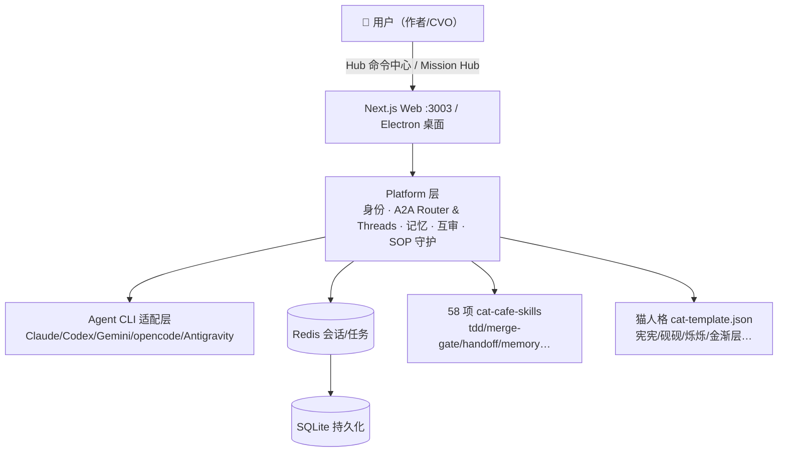

# clowder-ai 原始设计（01）

> 总分总：一句话总览 → 4+1 视图 / 设计理念 / 竞品优缺 / 演进方向 / 开发笔记 → 收束。
> 全部事实来自仓库 clone（main，depth 30）+ GitHub API；快照 2026-08-23。

---

## 总：一句话总览

> **clowder-ai 是一个"养猫"的多 Agent 团队平台：每个 Agent 都是有名字、有性格、有分工的猫，大家一起在隔离的工作线程（Threads）里协作，由平台负责身份、记忆、互审与纪律（SOP）。**

---

## 分：五个视角

### 4+1 视图（基于代码与文档，尽力还原）

| 视角 | clowder-ai 的事实 |
|------|------------------|
| 场景 | 单个 feature 一个 Thread；@ 猫名路由任务；跨模型互审（Claude 写、GPT 审）；陪伴场景（狼人杀/像素猫格斗/共创世界）也在产品里（F101/F090/F093/F258） |
| 逻辑 | 三层原则：Model → Agent CLI → Platform；Platform = api/shared/web/mcp-server/finance 五个 workspace 包 + cat-cafe-skills + SOP 定义；A2A 消息是协作骨架，MCP Callback Bridge 治理 124 个工具 |
| 进程 | Next.js Web 服务（:3003，支持 LAN）；Electron 桌面壳（自带 Node + Redis 的安装包）；Redis 7（可 `--memory` 免装）；Agent CLI 子进程以 stream-json/ndjson/ACP 等统一消息层接入 |
| 开发 | pnpm 9 monorepo；`docs/features/F###` 294 份规格 + ROADMAP 活跃表（in-progress 42 / spec 45）；AGENTS.md/CLAUDE.md/GEMINI.md 四铁律（数据圣所/进程自保/配置不可变/网络边界）；scripts/ 50+ 运维脚本 |
| 物理 | 单机优先（installer 自带运行时）；Redis 持久化会话跨重启自愈（F048）；开源仓 = 内部 cat-cafe 的脱敏"翻译出口"（sync 脚本 + sanitize 规则） |

### 核心设计理念（从文档/命名/代码里读出的五条）

1. **人格即产品（猫咖即 soul）**：`cat-template.json` v2 定义猫的 id/昵称/头像/配色/角色/性格/团队强项；名字是从真实对话里"自然长出来"的——产品不是功能集合，是"一支活的团队";
2. **Hard Rails（硬轨道）**：SOP 守护、合并门禁（merge-gate 技能）、互审协议（不可自审、跨家族互审 P1/P2/P3）、MCP 工具治理——纪律是平台的"地板"；
3. **Soft Power（软权力）**：A2A 异步消息 + @ 路由 + thread 隔离，让猫之间自由协作，人只在关键点介入；
4. **Shared Mission（共享使命）**：Mission Hub + 记忆路由 + 共享记忆——团队朝同一个目标对齐，而不是各干各的；
5. **模型无关**：支持 Claude/GPT/Gemini/Kimi/GLM/MiniMax/opencode/Antigravity——"你不再是（人肉）路由器"。

### 竞品优缺（基于定位推演；README 未点名竞品）

| 优点 | 缺点/风险 |
|------|----------|
| **跨模型互审内建**：Claude 写、GPT 审——这是绝大多数 agent 平台没有的"团队纪律" | 单维护者（all `@zts212653` CODEOWNERS），社区贡献通道刚开启（#524/#1105/#1183） |
| **人格化体验**（养成系猫咖）带来远超功能的产品粘性与情绪价值 | Threads/猫/技能体系学习成本高，新用户第一小时会有陡峭感 |
| 规格驱动（294 F###）+ 教训库（LL-001~099+）工程文化惊人 | 开源仓版本治理弱：tag 全为 `sync/*` 快照，内部版本号 0.1.0 不对外，用户跟进版本靠"快照" |
| 本地优先、LSP/互审/SOP 全套团队基建 | 依赖 Redis（即使是免装模式）与较重的桌面安装包，轻量程度不如单进程方案 |
| 与主流 CLI 适配层齐全（含 ACP） | 最早完成的外部接入（F050）集中在 2026-04 前后，后续 L2 A2A 仍是"设计稿待立项" |

### 演进方向（仓库里看得到的）

- 进行中（in-progress 42 项）：持久 MCP Agent-Key Auth（F178）、桌面自更新（F273）、多用户（F077）、**"看得见的猫咖"星图**（F258）、Telegram 网关（F088）、记忆系统（F271/F276/F289）等；
- 规格待定（spec 45 项）：AGY Durable Execution & Recovery（F261）、Hostable Agent Runtime（F143）——**注意：这两项正是与 workpanelConnecter「可靠执行/可托管运行时」理念直接交叠的地方**；
- 方向判断：从"多模型互审团队"向"可托管、可长大的陪伴+生产力复合体"演进（游戏夜 F101 说明陪伴不是玩票）。

### 开发笔记（版本与节奏）

| 阶段 | 时间 | 特征 |
|------|------|------|
| v0.1–0.4 | 2026-03-29 → 04 月中 | 起步：核心线程模型、CLI 适配层雏形、cat 人格化；v0.5.1 主打"ACP Stability & Crash Fix" |
| v0.5–0.8 | 2026-04 | 稳定化：4 月连续每周一版，外部 Agent 接入完成（F050 done 04-10，DARE/OpenCode/Antigravity/Kimi 验证） |
| v0.9–0.12 | 2026-05 → 07-26 | 平台化：互审 SOP 成熟、skills 库扩充、Web/桌面形态稳定；发布节奏降为月更 |
| 2026-08 | 快照期 | 高频 `sync: cat-cafe <sha> → clowder-ai (manifest v3)` 同步提交；最近提交聚焦 codex/opencode/gemini 适配修复与 session 策略（`1752681`） |

---

## 总：收束

- clowder-ai 用"**猫 + 纪律**"回答了两个问题：**用户为什么留下**（soul/陪伴/记忆）与 **Agent 为什么靠谱**（互审/SOP/硬轨道）；
- 它最大的开放性在于"模型无关的适配层 + A2A"，最大的封闭性在于"人格体系与内部管理强耦合、开源仓是出口"；
- 对 ohMyWorkPanel 的启示：**平台层与执行层分离是对的；但"人格/soul"不是可选项，是用户留存的最强杠杆**（详见 02 对比与 04 作者关注）。