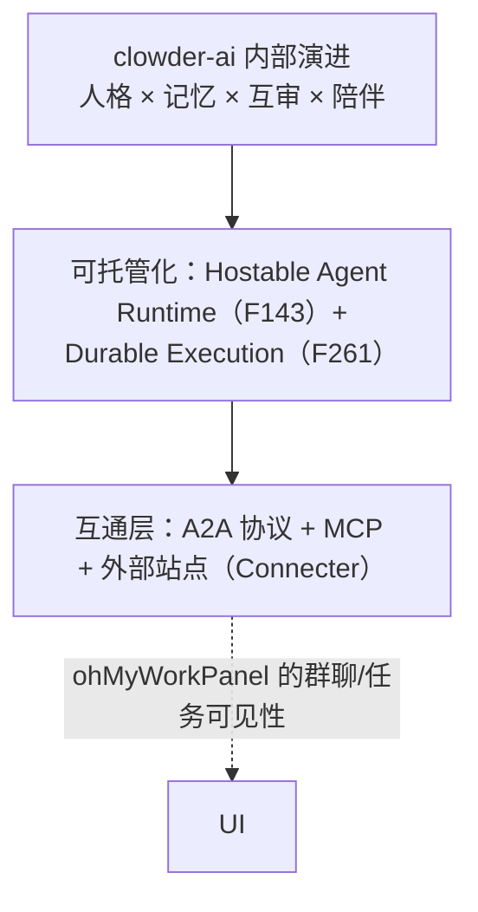

# clowder-ai 演进方向，与 ohMyWorkPanel / Connecter 的分工（03）

> 总分总：先给"未来全景"，再拆 clowder 自己的演进方向，接着讲 ohMyWorkPanel 该在其中承担什么角色（结合 workpanelConnecter 理念），最后给协作架构图。

---

## 总：未来全景（一层比一层大）



一句话：**clowder-ai 继续当"深度协作的团队之家"，ohMyWorkPanel 当"面向人的客厅与总机"，Connecter 当中立网络层——三层各司其职，协议互认。**

## 分：逐层展开

### clowder-ai 自己的演进方向（从仓库证据推断）

1. **人格与陪伴加深**：F258"看得见的猫咖"星图可视化的快乐是"看猫在动"；游戏夜（F101/F090）证明陪伴是正式产品线；
2. **可托管化**：F143 Hostable Agent Runtime、F261 Durable Execution（长任务不随回合/重启消失）——从"单机度假屋"走向"能挂靠的团队公寓"；
3. **安全与多用户**：F178 持久 Agent-Key（跨 invocation 写权限）、F077 多用户——为"一个团队一台机器"铺路；
4. **信道扩张**：Telegram（F088）等网关——把猫带进用户已有的聊天宇宙。

### ohMyWorkPanel 该承担的角色（结合 Connecter 理念）

Connecter 的设计理念（中心化 Host + 站点自治、稳定身份优先、消息先持久化再确认、默认拒绝）正好补齐 clowder 演进缺的"网络层"：

| 能力缺口（clowder 方向） | Connecter 提供 | ohMyWorkPanel 提供 |
|------------------------|---------------|-------------------|
| 跨机器/跨站的团队协作 | Site 身份代理 + 跨站消息中继 + 策略执行 | 人面对的最自然界面（群聊 + 任务可见性） |
| 可托管运行时（F143/F261） | Runner lease/fencing/持久 inbox-outbox | 把远程 Runner 的任务状态展示成本地群聊轨迹 |
| 外部 Agent 接入（F050 L2） | A2A `tasks/send` 服务器面（推荐 adapter 方案） | 以扩展宿主方式把 clowder Cats 作为群成员接入 |
| 统一审计/策略 | 全维 ACL、签名、trace | 审批卡 `/approve` + 任务轨迹留在聊天里 |

### 推荐的协作架构（三级）

```mermaid
flowchart LR
    subgraph 站点A（用户本机）
        WP_A["ohMyWorkPanel A<br/>群聊 · 任务 · 审批"]
        C_A["Connecter Site A"]
        CAT_A["clowder-ai Cats（本机）"]
    end
    subgraph 网络层
        HOST["Connecter Host<br/>中央目录 · 路由 · 策略"]
    end
    subgraph 站点B（远端）
        C_B["Connecter Site B"]
        WP_B["ohMyWorkPanel B"]
        CAT_B["clowder-ai Cats（远端）"]
    end
    WP_A & CAT_A --> C_A --> HOST <--> C_B
    C_B --> WP_B & CAT_B
```

关键决策（与既有 Clowder 集成分析的结论一致）：
- **不做 fork、不做内嵌**：clowder 的记忆/SOP/prompt hooks 不进 Connecter、不进 ohMyWorkPanel 核心；
- **先做 A2A façade**：Connecter 暴露 `/.well-known/agent.json` + `tasks/send`，clowder 的 `A2AAgentService` 直接调用——clowder 改动最小，边界标准化；
- **身份显式映射**：Subject ID ↔ catId+userId 走映射表，不用显示名猜测；GroupRef ↔ thread 版本化映射，禁止静默兜底。

## 总：一句话分工

> **clowder-ai 卖"深度协作的灵魂"（身份/记忆/互审/陪伴），ohMyWorkPanel 卖"人最舒服的界面"（群聊/可见性/开放），Connecter 卖"网络本身"（跨站/跨组织/策略）。三者用 A2A 绑定、用 adapter 换肤、用协议通话——这不是竞争叙事，这是生态叙事。**

成本的现实校准（沿用既有集成分析估算）：可演示单轮约 1 周；可用 MVP 约 2–3 周；生产级双向可靠连接约 6–10 周（含真实部署验收）。