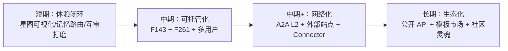

# 作者关注的四个问题（04）

> 总分总：四个问题各自 问题 → 事实与推演 → 建议；最后收束为"clowder-ai 的竞争与商业剧本"。
> 数据快照 2026-08-23。

---

## 问题 1 · agentTeam 赛道的竞品有多少？clowder-ai 怎么保证竞争力？

**事实**：直接竞品（本地/半本地多 Agent 团队平台）数量在个位数级别——Clowder / OpenClaw / ohMyWorkPanel 是目前最接近的三家；而宽口径（classical agent frameworks：LangGraph、CrewAI、AutoGen、OpenAI Agents SDK、MetaGPT、CAMEL 等）加起来有数十个，另有云端 SaaS（如各类 agent 工作台）。

**竞争力从哪来**（clowder 的三个别人难抄的点）：
1. **跨模型互审 + SOP 纪律**：多数框架让 Agent "合作"，clowder 让 Agent "互相负责"——这是工程叙事上的稀缺品；
2. **人格化（猫咖）**：功能可以被 copy，但"养成一支猫团队"的体验与社区记忆很难被 copy（名字/性格/共创世界都是资产）；
3. **规格驱动 + 教训库的文化**：294 份 F### 与 LL-001~099+，意味着迭代质量有纪律，第三方读得懂、接得进。

**建议**：不跟框架比"功能数量"，只比"团队体验"。对外把"互审 + 记忆 + 猫"打包成一个可讲的故事（"你的 AI 同事，不是工具"）；同时加快 F178/F261/F143 三个"可托管、可持久"的基建——那是从"个人玩具"走向"团队基建"的门票。

## 问题 2 · clowder-ai 的未来应该怎么发展？

**推演**（按依赖排序）：

- **短期（1-2 季度）**：把"看得见的猫咖"（F258）做好是性价比最高的——用户的快乐可视化，留存与自传播都会涨；
- **中期**：Durable Execution 与 Hostable Runtime 决定它能否从"个人团队之家"变成"组织团队基建"；
- **长期**：能不能接受"不是唯一入口"——通过 A2A 让其他平台（如 ohMyWorkPanel）把 Cats 当成员接入，换取生态位而不是孤岛。

## 问题 3 · 猫咖（soul）该怎么演进？soul 是否可替换（换提示词变 cosplay）？

**事实**：soul 现在 = `cat-template.json`（roleTemplates：id/昵称/头像/配色/角色/性格/团队强项）+ 记忆 + skills 的绑定。也就是说 **soul 已经部分"配置化"**——猫的皮（名字/头像/设定）是与代码解耦的。

**分析**：可替换性分三层：

| 层 | 现在的状态 | 可替换性 |
|----|-----------|---------|
| 皮（名字/头像/配色/提示词） | cat-template 已配置化 | ✅ 高——换提示词即可 cosplay（这也是用户设想的"猫换角色"） |
| 骨（记忆/互审/SOP/分工绑定） | 与平台深度耦合 | ⚠️ 中——换骨 = 换平台能力，不是提示词能解决的 |
| 心（用户与猫建立的关系/共创世界） | 不可导出、不可迁移 | ❌ 低——soul 的资产恰恰不可替换，这是粘性也是锁定 |

**建议**：
1. **soul 内核化**：把"人格配置"从 clowder 专属升级为开放规格（类似 cat-template 的通用化 schema），让"换 soul"成为产品特性而非 hack——提供官方 soul 市场（新用户可领养、可创作、可交易）；
2. **cosplay 从"换皮"升级为"换性格协议"**：同一只猫换一套提示词 = 换角色，但保留记忆与关系——这才是"可替代 soul 内核"的正解（用户既想要新鲜感，又不想失去已积累的关系资产）；
3. **给 soul 一个"换乘"仪式**：类比游戏转职，soul 更换做成有叙事的事件（告别/继承），情绪价值加倍。

## 问题 4 · clowder-ai 的商业价值有多大？生态怎么建设？

**事实**：无法从仓库判断收入模型（无定价/订阅信息）。可观察的信号：MIT 开源 + CLA + TRADEMARK（品牌/猫形象受商标保护）+ 社区（LINUX DO 论坛话题、飞书、Telegram in-progress、少量外部 PR）。

**推演商业剧本（三阶段）**：

| 阶段 | 模式 | 依据 |
|------|------|------|
| 1. 产品货币化 | 桌面付费/高级功能订阅（托管记忆、多用户、移动端） | "情绪价值付费"已被猫咖验证：用户愿为陪伴/养成付费 |
| 2. 团队货币化 | 团队版：多用户 + 权限 + 审计 + 可托管运行时（F143） | 组织为"AI 团队基建"付费，对标"AI 员工管理系统" |
| 3. 生态货币化 | soul/技能/模板市场抽成 + 企业集成服务（Connecter 类） | 2.7k star 是种子用户池，市场是"氛围经济"的变现口 |

**生态建设建议**（顺序很重要）：
1. **先给贡献者"能赢的入口"**：虚幻的 star 不如真实的 merge 体验——公开 ROADMAP 认领机制、P0/P1 标签、新手友好 issue（现状 CONTRIBUTING 已立 PR 流程，但单维护者是瓶颈：考虑"三猫 review"开放为"社区 review + 维护者终审"）；
2. **灵魂开源、内核半开**：猫人格模板与 skills 全开源（社区可创作），核心（身份/互审/SOP）以 API/文档公开——既保生态活力，又保商业内核；
3. **反哺带货**：让社区"领养猫"变成官方推荐位——好的 soul/技能上榜 = 免费流量，形成内容飞轮；
4. **与邻居平台共建**（ohMyWorkPanel/Connecter）：A2A 互通带来的互导流量，比纯广告更可信。

---

## 总：收束

- **竞争力** = 互审/记忆/人格组合拳 + 规格驱动的工程文化；
- **未来** = 体验闭环 → 可托管化 → 网络化 → 生态化 的四级跳；
- **soul** = 皮可换、骨难换、心不可换——"可替换 soul 内核"应以"保留关系资产"为前提设计；
- **商业** = 产品付费 → 团队付费 → 生态抽成 三阶段；生态从"贡献者易赢"开始建。

> 这些结论如何落到 ohMyWorkPanel 自己身上，见 [05 联合思考](05-joint-thinking.md) 与 [从0搭建MultiAgent平台/06 战略思考](../../作者随笔/从0搭建MultiAgent平台/06-strategy-thinking.md)。