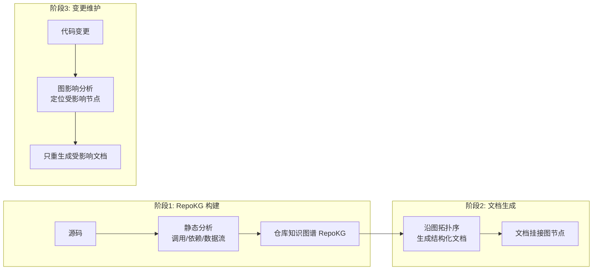
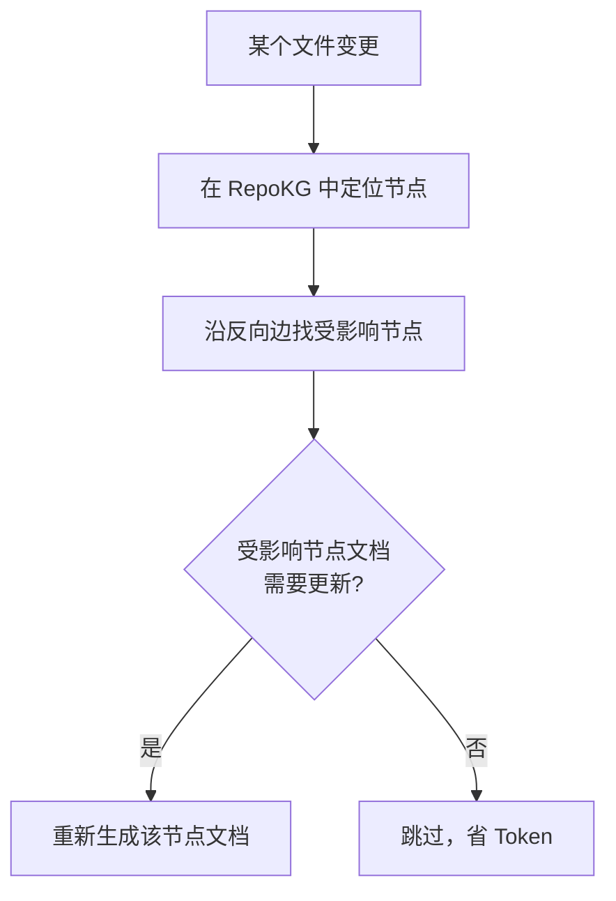

# RepoDoc — 知识图谱驱动的仓库文档生成

> 论文：https://arxiv.org/abs/2604.26523
> 名称：RepoDoc: A Knowledge Graph-Based Framework to Automatic Documentation Generation and Maintenance

## 基本信息

| 项目 | 内容 |
|------|------|
| **链接** | https://arxiv.org/abs/2604.26523 |
| **发布时间** | 2026-04 |
| **一句话总结** | 用**仓库知识图谱（RepoKG）**作为整个文档生命周期的语义地基：先建图，再沿图生成结构化文档，变更时沿图传播更新 |
| **核心创新** | 文档生成从"平面碎片处理"升级为"图结构语义处理" |

## 置信度评估

| 信号 | 评估 |
|------|------|
| 发表场所 | arXiv 预印本（2026-04） |
| 引用/影响 | 低（新发布） |
| 代码可用 | 待确认 |
| 来源机构 | 学术机构 |
| **综合置信度** | **⚠️ 谨慎**（新发布，但方法与飞轮第一步直接对应） |
| 需谨慎点 | 图构建与生成的工程细节需复现；与 RepoAgent 的增量更新对比待验证 |

## 它解决了什么问题

大代码库的文档维护是老大难：

1. **现有工具把源码当平面碎片处理**：一个文件一个文档，彼此孤立，丢失了文件之间的依赖、调用、数据流关系
2. **生成的文档缺乏语义结构**：读者（人类或 LLM）看不出"这个模块被谁用、改了会影响谁"
3. **Token 消耗大、生成慢**：平面处理导致重复分析相同代码
4. **变更传播靠猜**：代码改了，哪些文档需要跟着改，靠 diff 模糊推断

RepoDoc 的核心洞察：**代码仓库本身就是一张图**（调用图、依赖图、数据流图）。文档生成应该先建图，再沿图生成，变更也沿图传播。

## 方法核心

### 三阶段框架

**阶段 1：RepoKG 构建**

从源码提取三类关系：
- **调用关系**：函数 A 调用函数 B
- **依赖关系**：模块 A import 模块 B
- **数据流关系**：变量/接口的传递链

形成统一的知识图谱，每个节点对应一个代码单元（文件/函数/类/模块），每条边对应一种语义关系。

**阶段 2：沿图生成文档**

- 按图的**拓扑序**生成（先依赖、后被依赖），保证生成某节点文档时，其依赖节点的信息已就绪
- 文档内容包含：该节点做什么、依赖什么、被谁依赖（上游下游一目了然）
- 文档节点与图节点一一对应，天然可追溯

**阶段 3：变更传播**

变更只重生成受影响的文档，避免全量重跑。

### 与 RepoAgent 的对比

| 维度 | RepoAgent | RepoDoc |
|------|-----------|---------|
| 结构基础 | 依赖拓扑序（隐式） | 显式知识图谱 RepoKG |
| 变更维护 | 增量更新（依赖分析） | 图影响分析（沿边传播） |
| 文档间关系 | 弱（各文档独立） | 强（文档挂接图节点） |
| 语义结构 | 依赖驱动 | 调用+依赖+数据流三关系 |

## 实验结果（摘要信息）

- RepoDoc 生成的文档在结构完整性和语义关联性上优于平面处理基线
- 变更维护阶段通过图影响分析显著减少需重生成的文档数量（降低 Token 消耗）
- 论文强调图结构的"语义地基"价值：文档是图上的投影，而非孤立产物

## 局限与注意

- **图构建质量依赖静态分析**：动态语言（Python/JS）的调用关系分析不完整，图可能漏边
- **预印本未复现**：具体评测基准和数值待独立验证
- 知识图谱本身的存储和查询有工程成本，小型仓库可能不值当

## 对我们项目的启发

### 直接借鉴 ✅

1. **飞轮第一步的生成顺序**：RepoDoc 与 RepoAgent 独立验证了同一结论：**先依赖、后被依赖的拓扑序生成**，用显式图谱（RepoKG）比隐式依赖分析更可控
2. **变更传播 = 知识增量更新**：我们的知识文档随源码变更需要更新，RepoDoc 的"图影响分析 → 只重生成受影响节点"直接可借鉴：**知识文档挂接代码单元节点，变更沿依赖边传播**
3. **文档-图-代码三方可追溯**：每份知识文档对应一个代码单元，门禁对比时能精确定位"这份知识对应哪段源码"

### 需要改造 🔧

- RepoDoc 的图是**静态分析产物**；我们的知识文档是**解释型 Markdown**（含编写原因/设计逻辑）。可以把 RepoKG 作为知识文档的**索引骨架**，知识正文仍是解释型内容，两者结合
- 上亿行代码的图构建：需要分层建图（模块级 → 文件级 → 函数级），避免单图爆炸

### 需要注意 ⚠️

- 动态语言静态分析的漏边问题：我们自己的仓库如果是动态语言为主，图构建要结合运行时信息或放宽为启发式

## 关联

- [repoagent.md](repoagent.md) — 拓扑序生成 + 增量更新的前作，两者互相印证
- [docagent.md](docagent.md) — 多 Agent 协作文档生成
- docs/knowledge-format.md §5 — OKF 格式锚点（文档组织方式）
- [knowledge-graph-codegen.md](knowledge-graph-codegen.md) — 知识图谱增强代码生成（下游消费侧）
