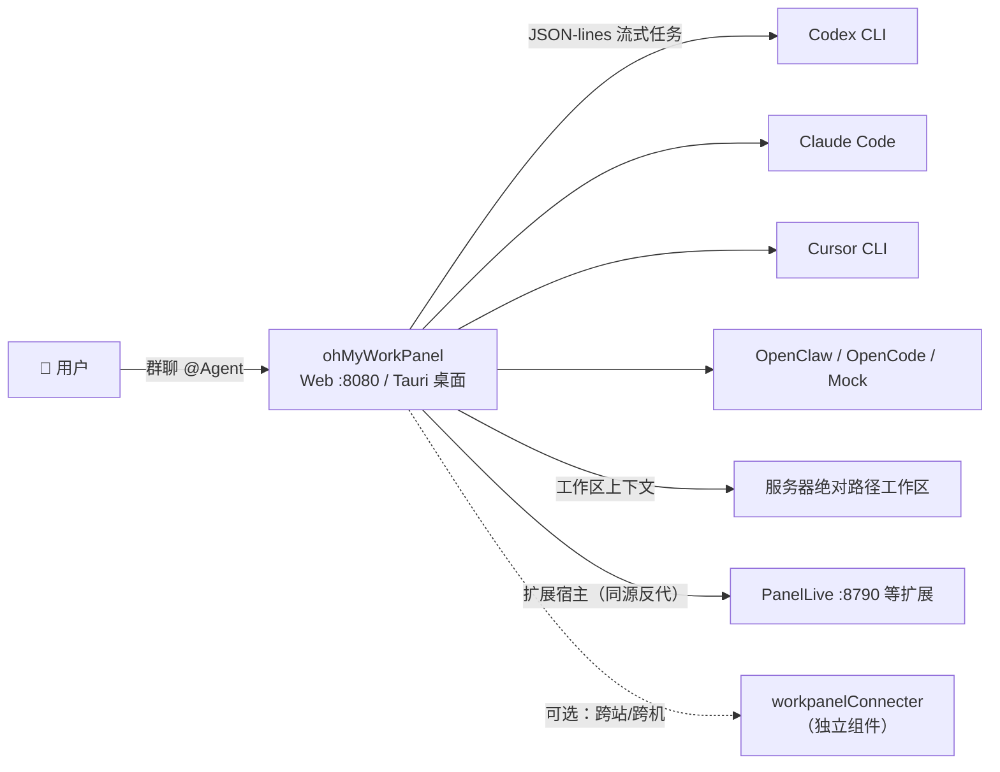

# ohMyWorkPanel · 原始设计解读（对外交流主文档）

> 本文是 **ohMyWorkPanel**（原 LinlisWorkPanel / workPanel）面向对外交流的「原始设计」解读。
> 采用 **总分总** 结构：先一句话看懂它是什么，再分五个视角展开，最后回到它的价值主张。
> 所有内容基于公开仓库（[linlisWorkTeam/ohMyWorkPanel](https://github.com/linlisWorkTeam/ohMyWorkPanel)，MIT）的代码、文档与 git 历史。

---

## 总：一句话介绍

> **ohMyWorkPanel 是一台「本地优先的多 Agent 群聊协作面板」：把群聊、工作区和 Agent 任务放进同一个界面，像在群里 @ 同事一样 @ 你的 AI 助手，让它们用你电脑上已经装好、已经登录的 CLI（Codex / Claude Code / Cursor / OpenCode / OpenClaw……）在同一工作区里干活。**

一句话背后的三层含义：

1. **群聊是入口**：任务不是"提交个表单"，而是"在群里说一句话 @ 某位 Agent"——协作范式与真实团队一致；
2. **本地是边界**：Agent 在本机工作目录直接执行，数据不出设备，不需要托管的云端 Agent；
3. **生态是复用**：不重新造模型、不重新发明 CLI，把各家已登录的 Agent CLI 统一收进一个面板。

## 分：五个视角

| # | 主题 | 一句话问的是 | 文档 |
|---|------|------------|------|
| 1 | [4+1 架构视图](01-4plus1-view.md) | 它由哪几块组成、怎么跑起来 | 场景 / 逻辑 / 进程 / 开发 / 物理 |
| 2 | [核心设计理念](02-core-design-philosophy.md) | 为什么这样设计 | 本地优先、群聊即协作、CLI 生态复用、扩展宿主、可审计轨迹 |
| 3 | [竞品对比：优点与缺点](03-competitive-analysis.md) | 它和市面上的产品比强在哪、弱在哪 | Clowder / OpenClaw / 编排框架 / A2A 协议 |
| 4 | [后续演进方向](04-evolution-roadmap.md) | 接下来往哪走 | 已交付 → 排期 → Backlog → 战略方向 |
| 5 | [从立项到现在的开发笔记](05-development-notes.md) | 这 5 周走过来都经历了什么 | v0.x → v2.1.x 版本史与功能演进 |

## 总：它想成为什么（价值主张）

- **对个人开发者/小团队**：用最少的部署成本（一条 `cargo run` 或一个 Tauri 应用），得到"看得见、管得住的 AI 团队"——聊天界面里就能看到每个 Agent 的任务状态、输出和结果，不再盲信黑盒。
- **对 Agent 生态**：做一个**协议中立、CLI 复用的聚合层**，不绑架任何模型或框架；并通过扩展宿主（Extension Host）与未来的 Connecter 打通"更多 Agent 平台互通"的想象空间。
- **对开源社区**：MIT 许可、文档按 Diátaxis 组织、有明确的版本流水线与贡献门禁——目标是成为一个别人愿意接入、愿意贡献的开放项目。

> 更进一步的战略思考（差异化、soul、生态、开源与 dsh 集成等讨论），见 [06-战略思考：与作者的共同命题](06-strategy-thinking.md)。clowder-ai（猫咖）的专题调研见 [research/clowder-ai调研](../research/clowder-ai调研/README.md)。

---

*文档日期：2026-08-23 ｜ 数据快照：仓库 main 分支（v2.1.1，2026-08-23）*