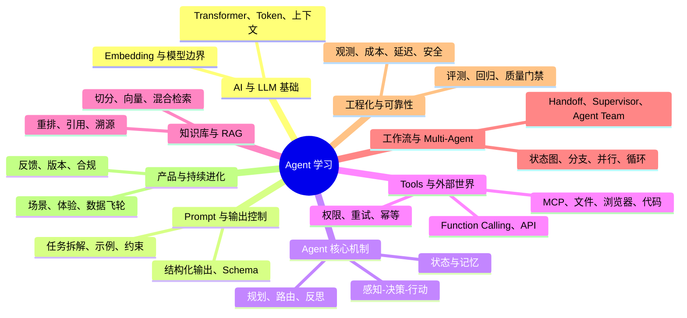

# learnByWork：通过真实项目学习 Agent

> 把 `wpKnowledge` 当作一个可阅读、可运行、可验证的 Agent 学习样本。

## 这里解决什么问题？

Agent 学习不只是一组 Prompt 技巧，也不只是调用一个模型。它需要把模型能力、工具调用、知识检索、工作流编排和生产工程连接起来。

`learnByWork/` 是面向人的学习入口：

- 用真实仓库中的代码和文档解释 Agent 概念；
- 每个主题都尽量对应一个可运行的小实验；
- 通过测试、评测和复盘验证“为什么这样设计”；
- 学习文档与运行时实现分离，避免把教程内容混入核心系统。

## 学习地图

## 推荐学习顺序

1. **读懂底座**：理解 LLM、Prompt、结构化输出和 Agent 闭环。
2. **做出单 Agent**：让它能够调用一个工具，并正确处理失败。
3. **接入知识**：完成一个可引用、可更新的 RAG 流程。
4. **编排工作流**：加入状态、条件分支、循环和人工确认。
5. **拆分 Multi-Agent**：明确角色边界、交接协议和共享状态。
6. **走向生产**：补齐评测、Tracing、安全、成本和部署。
7. **持续复盘**：将实验结果沉淀为规范、测试和可复用模式。

## 与仓库其他目录的边界

| 目录 | 责任 |
| --- | --- |
| `learnByWork/` | 面向学习者的教程、实验、图示和复盘 |
| `packages/` | 可复用的领域、应用和适配器实现 |
| `apps/` | CLI、HTTP API、Dashboard 等应用入口 |
| `knowledge/` | 研究资料和可评审知识来源 |
| `specs/` | 需求、架构、Schema、ADR 和验收规范 |
| `tests/` | 自动化测试与回归验证 |

学习文档应优先链接到现有实现，不复制一套平行代码。新的实验如果需要代码，放在明确命名的示例或测试范围内，并说明它与正式运行时的关系。

## 本分支的定位

`feature/learnByWork` 是学习内容的孵化分支。先在这里形成：

- 一套循序渐进的 Agent 课程目录；
- 可运行的小实验和对应评测；
- 从需求到实现、测试、复盘的完整案例；
- 适合公开阅读的导航和项目说明。

内容稳定后，再通过 Pull Request 选择性合并到 `main`。
