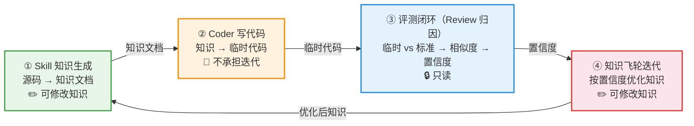
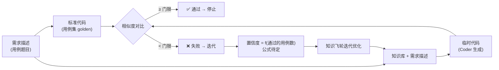

# 知识飞轮流程设计（Flywheel）

> 最后更新：2026-08-20（新增：角色分工、溯源归因、反馈结构）

## 1. 飞轮目标

通过"知识 → 代码 → 反馈"的循环，使**基于知识生成出来的代码越来越趋近于原始源码**，从而验证并持续提升知识文档的质量。

## 2. 主力路线（四步循环）

### 2.1 知识生成（Knowledge Generation）

- **输入**：源码仓库中的原始源码。
- **执行者**：一个 Skill（基于 GLM 5.1）。
- **输出**：Markdown 知识文档（见 [knowledge-format.md](knowledge-format.md)）。
- **核心原则：控制信息损失率**。文档 = 伪代码（保留实现逻辑的"魂"）+ 为什么这样设计。Agent 生成代码与源码的差异 ≈ 文档丢掉的信息量：丢太多则迭代无法收敛，丢太少则等于搬运源码。伪代码的定位是保留边界处理、数据结构、调用关系等逻辑细节，丢弃命名/格式/样板代码（依据：[spec2rtl-agent.md](../research/doc-generation/spec2rtl-agent.md)、[llm-api-docs.md](../research/doc-generation/llm-api-docs.md)）。

### 2.2 代码生成（Code Generation）

- **输入**：上一步生成的知识文档（仅基于知识，不直接依赖源码）。
- **执行者**：**Coder Agent**（基于 GLM 5.1），只负责检索知识 + 写代码，不负责验证。
- **输出**：根据知识生成的代码。

### 2.3 差异对比（Diff & Analysis）

- **输入**：Coder 生成的代码 vs 原始源码。
- **执行者**：**Review Agent**（独立于 Coder，基于 GLM 5.1）。
- **动作**：差异定位（diff 级别）、差异归因（溯源映射，见 §4）、生成反馈（见 §5）。

### 2.4 反馈优化（Feedback Loop）

- **输入**：Review Agent 的结构化反馈 + 归因结果。
- **执行者**：Skill（知识生成方）。
- **动作**：按归因结果修改对应文档段落 → 回到 2.2 重新生成代码 → 再对比 → 再反馈……

```
┌──────────┐    ┌──────────────┐    ┌──────────────┐    ┌──────────────┐
│ 源码仓库  │ →  │ Skill 生成知识 │ →  │ Coder 写代码  │ →  │ Review 对比差异 │
└──────────┘    └──────────────┘    └──────────────┘    └──────────────┘
      ↑                                                         │
      └──── 反馈：归因结果驱动知识修改 ←──────────────────────────┘
```

## 3. 角色分工与职责分离 ⭐

> 结论：**生成与验证必须分离**。依据：[critic.md](../research/feedback-loop/critic.md)（外部验证 > 内部反思）、[fragility-self-improving.md](../research/feedback-loop/fragility-self-improving.md)（客观信号优先，防自欺）。
> 职责边界补充：项目讨论共识（2026-08-20），详见 [gate.md §3.6](gate.md)。

### 3.1 角色职责总表

| 角色 | 职责 | 不做什么 | 是否允许修改知识 |
|------|------|---------|-----------------|
| **Skill（知识生成）** | 源码 → 知识文档；按反馈修改知识 | 不写业务代码、不验证 | ✅ 允许 |
| **首次生成 Agent** | 知识库的首次生成 | 不承担评测 | ✅ 允许 |
| **Coder Agent** | 检索知识 → 写代码（知识库 → 临时代码） | **不承担迭代逻辑**、不验证自己的输出 | ❌ 不修改知识 |
| **Review Agent** | 差异对比、归因、生成反馈、门禁判断 | 不修改知识（只报告） | ❌ 只读 |
| **评测闭环** | 用例集驱动：需求描述 + 知识库 → 临时代码 vs 标准代码 → 相似度 → 置信度 | **只读，不修改知识** | ❌ 只读 |
| **知识飞轮** | 根据置信度迭代优化知识 | 不直接写业务代码 | ✅ 允许 |

### 3.2 职责边界规则

1. **谁评测谁不改**：评测过程（含 Review Agent）只读，输出置信度与归因报告，绝不直接修改知识
2. **谁生成谁可改**：允许修改知识的只有**知识飞轮**和**首次生成 Agent**
3. **Coder 不迭代**：Coder 只负责把知识库转成代码，迭代逻辑由知识飞轮承担
4. 门禁判断（≥门限）不依赖任何 agent 的自我感觉，由评测闭环客观计算

### 3.3 飞轮总流程图（角色 × 流程）



> 备注：**首次生成 Agent** 与 Skill 同属生成域（✏️ 可改知识），**Review Agent** 与评测闭环同属评测域（🔒 只读）；职责细节见 [3.1 角色职责总表](#31-角色职责总表)。

### 3.4 评测闭环细节图



职责分离的理由：
1. LLM 评估自己的输出存在确认偏误，自己写自己评会"自信地错"
2. 门禁判断（≥80%）不依赖任何 agent 的自我感觉
3. 类比真实工程：写代码与 code review 分人

## 4. 溯源链接与差异归因 ⭐

> 结论：**怎么知道改文档哪部分 = 溯源链接反向映射**。依据：[repodoc.md](../research/doc-generation/repodoc.md)（文档挂接代码单元节点，变更沿图回溯）、[knowledge-catalog-okf.md](../research/knowledge-format/knowledge-catalog-okf.md)（OKF 的 sources 元数据）。

### 4.1 写文档时埋溯源

知识文档的每一段都必须标注**对应的源码位置**（文件:行 / 函数 / 模块）：

```
知识文档 §3.2「边界处理」
  ├─ 伪代码: if input is empty: return default
  ├─ 为什么: 兼容空输入是历史需求 #452
  └─ sources: src/utils/parser.py:120-135   ← 溯源链接
```

对应 OKF 的 `sources` 字段（见 [knowledge-catalog-okf.md](../research/knowledge-format/knowledge-catalog-okf.md)）。

### 4.2 差异对比时反向映射

```
生成代码 vs 源码 diff
    │
    ▼ 定位差异最大的源码位置
src/utils/parser.py:120-135 (差异大)
    │
    ▼ 通过溯源链接反向找到知识文档
知识文档 §3.2「边界处理」(该段知识质量差)
    │
    ▼ 只改这一段，不整篇改
```

### 4.3 知识薄弱点地图

- 某段知识反复触发差异 → 标记为薄弱段落，优先重写
- 某段知识从未触发差异 → 质量稳定
- 积累结果作为门禁的辅助信号

## 5. 反馈结构 ⭐

> 结论：**结构化信号 + 自然语言解读，两层结合**。依据：[self-debugging.md](../research/feedback-loop/self-debugging.md)（执行反馈最有效）、[feedback-over-form.md](../research/feedback-loop/feedback-over-form.md)（反馈质量 > 流程形式）。

纯自然语言反馈的缺陷：定位不精确、不可量化、无法支撑门禁判断。

| 层 | 内容 | 举例 |
|----|------|------|
| **结构化信号**（客观、可量化） | diff 定位（文件:行）、语义对比（AST/行为/测试）、相似度分数 | `parser.py:120-135 边界处理不符，相似度 62%` |
| **自然语言解读**（Review 翻译） | 差异原因 + 建议改文档哪部分 | "源码在空输入时返回默认值，生成代码抛异常。对应知识文档 §3.2 缺少边界处理说明，建议补充" |

## 6. 迭代粒度

- 按**代码单元**（函数/模块）级迭代，不整篇文档迭代
- 每个单元的知识独立评估、独立过门禁、独立合并回知识库
- 满足防污染约束（见 §8.5）：未过门禁的优化不合并 + 自动回滚

## 7. 备选路线（能力补齐，非主线）

- **思路**：破坏源代码（如删改/挖空关键片段），让 Agent 基于残缺代码**自行补齐**。
- **定位**：作为后续的**能力补齐**手段，**不是当前主要路线**。
- **与主路线的关系**：未来可融合。主路线解决"知识怎么来"，补齐路线解决"知识缺了怎么办"。

## 8. 迭代终止条件

- 知识文档通过 [门禁评测](gate.md)（如生成的代码与源码相似度 ≥ 80%）即视为合格，可停止迭代。

## 9. 设计硬性约束（可靠性）⚠️

> 依据：*On the Fragility of Self-Improving Agents*（arXiv 2608.18066，2026-08）→ [fragility-self-improving.md](../research/feedback-loop/fragility-self-improving.md)
> 该研究系统性检验了记忆型自改进 agent 的可靠性，发现：**同配置重复实验方差巨大、任务顺序影响结果、目标规格模糊会导致改进跑偏**。前期文献的乐观结论在严格控制下大幅缩水。

本飞轮属于"记忆（知识文档）驱动的自改进"，必须内置以下约束：

### 9.1 重复验证（对抗方差）

- 任何"知识优化后效果提升"的结论，**必须多次重复门禁评测**（建议 ≥ 5 次），报告均值 ± 方差，而不是单次数值。
- 单次评测的"提升"不可信，不得据此宣布知识合格。

### 9.2 控制任务顺序（对抗顺序效应）

- 知识生成/优化的执行顺序是影响整体质量的变量，不能随意。
- 设计知识生成顺序策略（如按依赖拓扑、先核心模块），并**测试顺序敏感性**：换一种顺序结果是否稳定。
- 对比实验必须固定顺序，否则"改进"可能是顺序的副产品。

### 9.3 精确定义目标（对抗规格模糊）

- 门禁阈值（80% 相似度）必须定义到可执行级别：相似度怎么算、对齐粒度、允许什么差异、什么算"通过"。
- 规格模糊时，飞轮会"自信地改进到错误方向"：知识越来越像源码的表面写法，但功能逻辑是错的。
- 门禁指标的精确定义质量 = 飞轮方向的正确性保障。

### 9.4 客观信号优先（对抗自我评估）

- 飞轮的反馈信号必须来自**客观对比**（生成代码 vs 源码、编译检查、测试结果），不依赖 LLM 自我评估。
- 即使客观信号，定义不清也会跑偏，信号定义质量与信号来源同等重要。
- 补充依据：[conself-self-improving.md](../research/feedback-loop/conself-self-improving.md)（内部信号可作辅助，但不能替代外部锚点）、[code-qa-bench.md](../research/evaluation/code-qa-bench.md)（防作弊归因）。

### 9.5 防知识污染

- 早期低质量知识可能被飞轮"学"进知识库（经验污染风险）。
- 知识变更必须走版本控制 + 门禁，**未通过门禁的优化不得合并**。
- 保留回滚能力：优化使知识倒退时（门禁分数下降），自动回退到上一版本。

## 10. 待细化事项

- [x] 差异对比的执行者（Review Agent 独立），已定，见 §3
- [x] 反馈的组织方式（结构化 + NL 两层），已定，见 §5
- [x] 知识修改的定位（溯源链接反向映射），已定，见 §4
- [ ] 差异分析的具体方法（diff 级别 / AST / 语义，三种如何组合打分）
- [ ] 溯源链接的存储与索引（frontmatter 字段规范，与 OKF sources 对齐细节）
- [ ] 迭代轮次上限 / 成本控制
- [ ] 知识生成的粒度与切分策略（上亿行代码如何切片）
- [ ] 薄弱点地图的量化定义（触发几次算薄弱）
