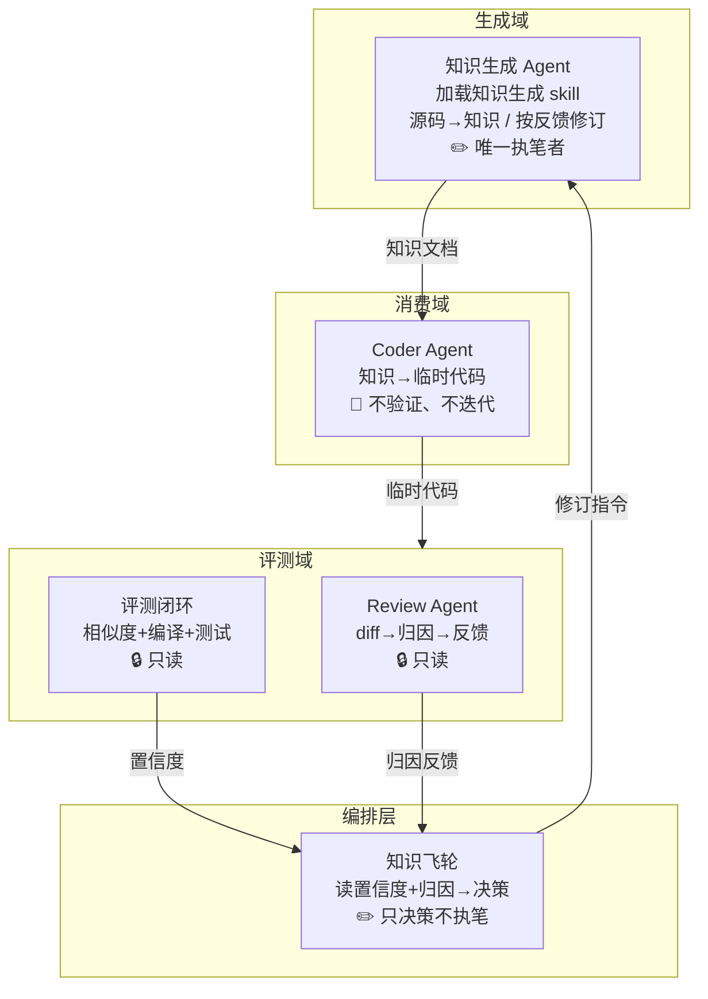
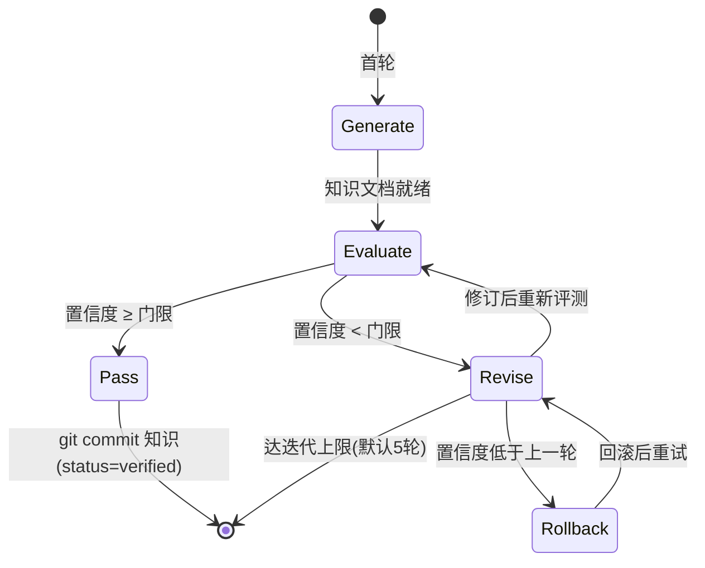

# 多 Agent 架构与框架选型任务文档（Multi-Agent Architecture Task）

> 最后更新：2026-08-21
> 用途：给 GLM 5.1 的任务书——知识飞轮的多 agent 架构怎么搭、用什么框架、按什么步骤落地。
> 配套：[implementation-plan.md](implementation-plan.md)（工程实现方案：目录/接口/分阶段）、[flywheel.md](flywheel.md)（角色分工设计）、[gate.md](gate.md)（门禁设计）。

---

## 0. 任务目标

搭建知识飞轮的**多 Agent 编排层**：让 4 个角色（知识生成 Agent / Coder Agent / Review Agent / 知识飞轮编排层）按固定循环协作，跑通"源码 → 知识 → 代码 → 评测 → 归因 → 知识修改"闭环。

本任务文档回答两个问题：
1. 用什么框架（含调研结论与选型理由）
2. 多 agent 架构怎么搭（角色、通信、状态、循环）

---

## 1. 框架选型：调研结论

### 1.1 2026 年主流框架格局

| 框架 | 定位 | 状态 | 是否适合本项目 |
|------|------|------|---------------|
| **LangGraph** | 有向图编排 + checkpointing + LangSmith 观测 | 活跃，生产级 | 部分：图能力我们用不上，云观测内网不可用 |
| **CrewAI** | 角色制团队（Role → Agent → Crew），顺序/层级流程 | 活跃，原型快 | 接近但不贴合：线性流程无法表达"循环迭代 + 条件分支" |
| **AutoGen (AG2)** | 对话式多 agent（GroupChat） | ⚠️ **维护模式**（微软合并进 Agent Framework） | 否：已停止新功能开发 |
| **Microsoft Agent Framework** | AutoGen + Semantic Kernel 合并 | 活跃 | 否：微软栈，模型无关性弱 |
| **DSPy** | 声明式 prompt 优化（非编排） | 活跃 | 否：解决的是 prompt 优化，不是多 agent 编排 |
| **DeepSeek Harness** | 事件溯源会话 + 插件化 harness（npm/TS） | 新（2026-08-13 开源） | 参考：架构思想可借鉴，生态语言不匹配 |
| **Pi (earendil)** | 同上，harness 类（npm/TS） | 成熟 | 参考：事件溯源 + 会话树思想，已写进实现方案 |
| **自研轻量编排** | Python 状态机/图 + 事件记录 | — | ✅ **推荐** |

### 1.2 选型结论：自研轻量编排，不引入重型框架

理由四条，按权重排序：

**① 本项目流程是固定循环，不是开放式多 agent 协商**
飞轮只有一条主循环：生成 → 写码 → 评测 → 归因 → 修订 → 再生成。分支只有三个（通过/迭代/回滚），且都由门禁置信度客观决定，不需要 agent 自由协商。LangGraph 的"动态图 + 条件路由"优势在此用不上；CrewAI 的顺序流程又表达不了循环。一个 Python 状态机（或简单图）足够。

**② 唯一模型 GLM 5.1，框架的"模型无关性"卖点无关紧要**
框架最大的价值是让你在不同模型间切换。本项目模型锁死为 GLM 5.1，直接用一个 client 封装（OpenAI 兼容接口）即可，多一层框架纯属负担。

**③ 核心机制框架给不了，得自己写**
门禁重复评测、防污染回滚、溯源归因、JSONL 事件记录——这些是本项目的灵魂，任何通用框架都不提供。框架反而会约束这些机制怎么写（例如 LangGraph 的 checkpointing 语义和我们的事件溯源会话是两套东西）。

**④ 内网环境，云观测不可用**
LangSmith / Langfuse 云服务在公司内网不可用。LangGraph 最大的生产优势（观测性）直接失效，剩下一个图执行器，价值大幅缩水。

> 数据支撑：2026 年约 28% 的生产 agent 部署使用自研编排（非框架）。"Adopt a framework only when the plain-Python version becomes genuinely hard to maintain"（DEV Community, 2026-03）——本项目尚未到那个复杂度。
>
> 参考：[LangGraph vs AutoGen vs CrewAI vs DSPy: The 2026 Multi-Agent Framework Decision Guide](https://agentmarketcap.ai/blog/2026/04/11/langgraph-autogen-crewai-dspy-multi-agent-orchestration-2026)、[Microsoft Retires AutoGen](https://agentmarketcap.ai/blog/2026/04/13/microsoft-autogen-maintenance-mode-agent-framework-sunset-2026)、[DeepSeek Harness vs Pi](https://docs.bswen.com/blog/2026-08-14-deepseek-harness-vs-pi/)

### 1.3 借鉴的设计模式（不引入框架，但抄思想）

| 来源 | 借鉴什么 | 用在哪 |
|------|---------|--------|
| Pi / DeepSeek Harness | 事件溯源会话（append-only 日志，可恢复/回放） | `storage/session.py`（JSONL 记录每次操作） |
| Pi | 会话树 + 分支摘要 | 扩展期：多轮迭代历史回溯 |
| Pi | Provider 适配层隔离模型 | `llm/client.py`（唯一 LLM 入口） |
| LangGraph | checkpoint 思想 | `storage/repo.py`（知识版本 git 提交/回滚） |
| CrewAI | 角色职责分离（Role 定义清晰） | 4 个角色模块独立（generator/coder/review/orchestrator） |

---

## 2. 多 Agent 架构设计

### 2.1 角色与职责（4 个执行单元）



### 2.2 通信机制：文件 + 结构化数据，不用 agent 间直接对话

这是本项目多 agent 架构的关键决策：**4 个角色之间不互相发消息，通过文件系统和结构化数据交接**。

```text
知识生成 Agent ──写──> workdir/knowledge/<doc>.md   （知识文档，带 frontmatter）
Coder Agent    ──写──> workdir/generated/<code>.py  （临时代码）
评测闭环       ──写──> workdir/reports/<run>.json   （评测报告：置信度+diff 定位）
Review Agent   ──写──> workdir/reports/<run>_attribution.json  （归因：diff→文档段落）
编排层         ──读──> 以上所有，决策后给知识生成 Agent 下发修订指令
```

理由：
- **可审计**：每一步产物落盘，人可查、可回放、可断点续跑
- **可测试**：每个角色可独立输入输出调试（CLI 单步命令）
- **符合只读原则**：评测域只写报告不碰知识文档，物理隔离
- **防作弊**：Coder 只读知识文档，物理上看不到源码

### 2.3 编排层：状态机（核心）

编排层是一个有限状态机，状态 = 轮次 + 置信度 + 是否通过：



决策规则（编排层只做这 4 件事，不执笔）：
1. 置信度 ≥ 门限 → 通过：提交知识（git + status=verified）
2. 置信度 < 门限 → 生成反馈 → 知识生成 Agent 修订
3. 置信度 < 上一轮 → 回滚到上一版知识再修订（防污染）
4. 达迭代上限 → 停止，报告未收敛

### 2.4 数据结构（角色间交接契约）

**知识文档**（OKF frontmatter）：

```yaml
---
name: parser-boundary-handling
sources:
  - file: src/utils/parser.py
    lines: 120-135
    function: parse_input
status: draft            # draft | verified
version: 1
---
```

**评测报告**（JSON）：

```json
{
  "run_id": "uuid",
  "round": 3,
  "confidence": 0.625,
  "similarity": {"text": 0.72, "ast": null},
  "compiles": true,
  "tests": {"passed": 5, "total": 8},
  "diff_locations": [{"file": "src/utils/parser.py", "line": 120, "kind": "missing_branch"}]
}
```

**归因报告**（JSON）：

```json
{
  "run_id": "uuid",
  "attributions": [
    {
      "diff_location": {"file": "src/utils/parser.py", "line": 120},
      "doc_paragraph": "§3.2 边界处理",
      "issue": "知识文档缺少空输入分支说明",
      "suggestion": "补充：if input is empty: return default"
    }
  ]
}
```

---

## 3. 实施任务清单（给 GLM 5.1 按顺序执行）

> 每个任务都有验收标准。做完一个再做一个，不要跳步。

### Task 1：项目骨架 + LLM 客户端（0.5 天）

**目标**：目录结构建好，GLM 5.1 能调通。

**动作**：
1. 按 [implementation-plan.md §2](implementation-plan.md) 建目录结构（flywheel/ 各子包 + tests/ + workdir/）
2. 建 `pyproject.toml`（Python 3.11，依赖：pyyaml、difflib 标准库、tree-sitter 留到 Task 5）
3. 建 `config.yaml`（GLM 5.1 端点、api_key、model、门限 0.8、迭代上限 5）
4. 实现 `llm/client.py`（chat / chat_json）和 `llm/prompts.py` 骨架
5. 实现 `cli.py`（init/gen/code/eval/run/status 子命令骨架）

**验收**：
- `pip install -e .` 成功
- `flywheel init` 创建 workdir 结构
- `LLMClient.chat("你好")` 返回 GLM 5.1 的回复（若端点不是 OpenAI 兼容格式，先改 client 再继续）

### Task 2：知识格式 + 生成器（1 天）

**目标**：源码 → 带 frontmatter 的知识文档。

**动作**：
1. 实现 `knowledge/format.py`：frontmatter 解析/构建、sources 提取、按溯源定位段落
2. 实现 `knowledge/generator.py`：`generate(source_code) -> doc`
3. 在 `llm/prompts.py` 写知识生成 prompt（保留逻辑魂、丢命名格式样板、每段标 sources）

**验收**：
- 对 200 行以内的真实单文件模块，生成的知识文档：有完整 frontmatter（name/sources/status）、每段带溯源、人读能还原逻辑
- `flywheel gen <file>` 可用

### Task 3：Coder + 评测闭环（1 天）

**目标**：知识 → 代码 → 相似度/置信度。

**动作**：
1. 实现 `coder/coder.py`：`generate(knowledge, requirement) -> code`
2. 实现 `gate/similarity.py`：文本相似度（difflib.SequenceMatcher）
3. 实现 `gate/evaluator.py`：相似度 + 编译检查（py_compile）+ 测试（有则跑）
4. 实现 `gate/confidence.py`：置信度 = 通过用例数 / 总用例数（用例缺失时 = 相似度）

**验收**：
- 同样代码相似度 ≈ 1.0，不同代码 < 0.5
- `flywheel code <doc> <req>` 和 `flywheel eval <gen> <golden>` 可用

### Task 4：归因 + 反馈（1 天）

**目标**：diff 定位 → 溯源映射 → 归因报告。

**动作**：
1. 实现 `review/differ.py`：difflib.unified_diff 输出差异块（文件:行）
2. 实现 `review/attributor.py`：diff 行号 → 知识文档 sources 反查 → 段落
3. 实现 `review/feedback.py`：生成两层反馈（结构化 + NL 归因）

**验收**：
- 人为删掉知识文档某段 → 生成代码出现对应差异 → 归因能定位回该段
- 归因报告 JSON 结构符合 §2.4

### Task 5：编排闭环 + 存储（1 天）

**目标**：整轮飞轮跑通。

**动作**：
1. 实现 `flywheel/orchestrator.py`：§2.3 状态机
2. 实现 `flywheel/state.py`：迭代状态
3. 实现 `storage/session.py`：JSONL 事件记录
4. 实现 `storage/repo.py`：知识文档 git 提交/回滚（未过门禁不合并、倒退回滚）
5. 相似度加 AST 比对（tree-sitter，可选，文本够了可后置）

**验收**：
- `flywheel run <module>` 完整跑 3 轮，日志显示置信度变化
- 人为制造知识缺陷 → 观察到"归因 → 修订 → 分数回升"
- 未过门禁的版本未合并；倒退轮次正确回滚

### Task 6：PoC 验证（1-2 天）

**目标**：证明闭环能收敛。

**动作**：
1. 选 1 个真实小模块（≤500 行、有边界逻辑的纯函数模块）
2. 跑 5 轮迭代 × 重复 5 次，记录置信度均值 ± 方差
3. 产出 PoC 报告：每轮数据、收敛曲线、结论

**验收**：
- 置信度从初始值提升到 ≥80% 或明显上升趋势
- 每轮反馈都能定位到具体文档段落
- 无污染：未过门禁版本未合并、倒退正确回滚

---

## 4. 常见坑（实现时注意）

1. **GLM 5.1 接口先验证**：假设 OpenAI 兼容，若不兼容所有 client 层要改——Task 1 第一件事就测
2. **防背源码**：评测用私有/变换代码，公开源码模型可能"背"过 → 高分不代表读懂了知识
3. **相似度误杀**：功能等价但写法不同会被文本 diff 误判 → 多信号（相似度+编译+测试）组合
4. **规格模糊跑偏**：门禁定义必须可执行（相似度怎么算、对齐粒度、什么算通过），否则飞轮"自信地改进到错误方向"
5. **重复评测**：单次置信度不可信，≥5 次取均值 ± 方差
6. **别引入 LangGraph/CrewAI**：即使看着方便，本项目固定流程 + 内网环境用不上它们的核心价值，还多一层依赖

---

## 5. 参考资料

- 框架对比：[LangGraph vs AutoGen vs CrewAI vs DSPy: The 2026 Multi-Agent Framework Decision Guide](https://agentmarketcap.ai/blog/2026/04/11/langgraph-autogen-crewai-dspy-multi-agent-orchestration-2026)
- AutoGen 维护模式：[Microsoft Retires AutoGen](https://agentmarketcap.ai/blog/2026/04/13/microsoft-autogen-maintenance-mode-agent-framework-sunset-2026)
- Harness 模式：[DeepSeek Harness vs Pi](https://docs.bswen.com/blog/2026-08-14-deepseek-harness-vs-pi/)（事件溯源/插件化思想）
- 自研 vs 框架：[Multi-Agent Orchestration: A Guide to Patterns That Work](https://dev.to/thedailyagent/multi-agent-orchestration-a-guide-to-patterns-that-work-1h81)
- 本项目设计：[flywheel.md](flywheel.md)（角色分工）、[gate.md](gate.md)（门禁）、[implementation-plan.md](implementation-plan.md)（工程实现）
