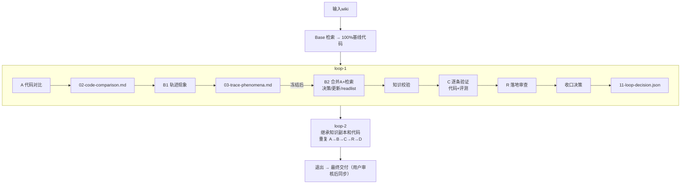

# 知识飞轮案例（参考实现）

> 来源：别的团队实现方案（2026-08-21 由用户提供，忠实记录，未改动原文内容）。
> 定位：知识飞轮理念在另一个团队业务场景的落地形态。**参考案例**，非本项目当前设计；与本项目设计的映射见文末 §11。

---

## 1. 总体目标

通过"知识 → 代码 → 反馈"的闭环迭代，使基于知识文档生成的算子代码持续趋近官方参考实现，同时反向验证并提升知识文档质量。

## 2. 退出条件（满足任一）

| 条件 | 说明 |
|------|------|
| 完美达标 | 正确率100% + avg_speedup >= target（默认1.0）+ Evolver声明"本轮无待实现知识" |
| 达到上限 | 循环轮次达到 max_loops（最大20） |
| 基础设施阻塞 | 加速硬件或远程环境形成有证据的阻塞 |

## 3. 三阶段顺序执行

阶段一：准备（prepare） → 阶段二：Base 算子开发 → 阶段三：飞轮循环（loop-1, loop-2, ...）

不可跳步，不可并行。

## 4. 核心角色与职责

| 角色 | 代号 | 核心职责 | 可读官方源码 | 可改代码 | 可检索知识 |
|------|------|---------|------------|---------|-----------|
| Base Developer | Base | 从知识生成100%精度基线代码 | ❌ | ✅ | ✅（审计） |
| Comparator | A | 静态代码对比，找出未吸收的优化点 | ✅（只读） | ❌ | ❌ |
| Evolver | B | 轨迹驱动知识演进，产出readlist | ❌ | ❌ | ✅（审计） |
| Verifier | C | 知识驱动代码验证，逐条实现优化 | ❌ | ✅ | ✅（审计） |
| Landing Reviewer | R | 落地审查纠偏，判断知识是否正确落地 | 弱（仅偏离点） | ❌ | ❌ |
| 主调度 | — | 状态管理、校验关卡、循环决策 | — | — | — |

**信息隔离**：每个角色在独立的新上下文中运行，不共享历史会话。

## 5. 阶段一：准备（Prepare）

输入参数：实验名、算子名、最大循环数、平台（平台A/B/C）、Wiki路径列表、远程环境信息。

关键步骤：

1. 解析输入：固定配置，写入 run_meta.json
2. 固定官方源码：从Wiki的 frontmatter.resource 解析内部代码托管 URL，sparse checkout到固定commit
3. 设置评测任务：准备cases定义、精度期望输出
4. 远程preflight（可选）：检查加速硬件可见性、工具路径
5. 初始化版本控制：生成 00-input-facts.md

产物：run_meta.json、_e2e_sources/（官方源码）、task/（评测任务）

## 6. 阶段二：Base 算子开发

角色目标：仅从知识文档产出精度100%的基线代码，不做性能优化探索。

硬约束：

- 设计前必须完成知识检索（discover → preflight → get）
- 禁止读取官方源码
- 核心计算必须在自定义内核内（禁止桩代码或host代算）

执行顺序：

1. 审计检索 → 读wiki → 写定义文档 + 设计文档
2. 实现算子代码
3. 小步构建 + correctness-only调测
4. 精度100%后冻结代码，创建commit
5. 执行且仅一次完整correctness+performance评测，生成canonical报告

必须产物：算子定义、设计文档、调测证据、基线结果（baseline.json）、STATE.md（全部勾选）

## 7. 阶段三：飞轮循环（Loop-1, Loop-2, ...）

### 7.1 循环目录结构

```text
loop-N/
├── 00-STATE.md              # 责任制状态清单（A/B/C/D四节）
├── 02-code-comparison.md    # A产出
├── 03-trace-phenomena.md    # B1产出
├── 04-knowledge-decisions.md # B2产出
├── 05-failed-mechanism-ledger.md
├── 06-knowledge-updates.md
├── 07-verifier-readlist.md  # B产出（核心）
├── 08-knowledge-validation.json
├── 09-verifier-progress.md  # C产出
├── 10-verifier-checklist.md
├── 11-loop-decision.json    # 主调度产出
├── 12-landing-review.md     # R产出
├── 13-correction-packet.md  # R产出（可选）
├── updated-knowledge/       # Verifier必读知识包（L<N>-K<n>.md）
├── knowledge_worktree/      # 可编辑知识副本（增量更新）
├── traces/                  # 各角色JSONL轨迹
├── evals/                   # 评测报告
└── csrc/                    # 代码快照
```

知识副本继承：

- loop-1：从输入wiki复制
- loop-N（N>1）：复制上一轮完整 knowledge_worktree，禁止重新读原始wiki

### 7.2 循环固定顺序

prepare_loop → A → B1 → B2 → 知识校验 → C → R → (可选verifier retry) → 收口决策

无匹配官方源码时A标记 skipped，直接进入B。

### 7.3 阶段A：Comparator（代码对比）

- 输入：本轮初始代码 + 官方源码 + 精简输入包（comparator-input/）
- 输出：02-code-comparison.md，每条候选含：维度、源码证据、差异描述、候选类型、模板/实现、命中条件、平台适用性等
- 硬边界：禁止读wiki/设计文档/verifier产物；每次读源码不超过150行

### 7.4 阶段B：Evolver（知识演进）

**B1：轨迹现象**（独立完成，禁止读A产物，禁止检索）

- 读输入轨迹（Base轨迹或上一轮Verifier轨迹）
- 输出 03-trace-phenomena.md，每条含稳定 B1-* ID、类别、证据、置信度

**B2：决策与知识更新**（B1冻结后进入）

1. 读A产物（若启用），逐条复核平台适用性
2. 审计检索（preflight + get）补足缺口
3. 模板/实现执行矩阵审计
4. 逐项决策（更新知识/已有知识无需改/证据不足/平台不适用等）
5. 更新失败机制总账 05-failed-mechanism-ledger.md
6. 按条目级delta更新 knowledge_worktree/
7. 输出 06-knowledge-updates.md
8. 输出 07-verifier-readlist.md（每条严格三字段：ID + 知识片段路径 + 验证判据）
9. 输出 08-knowledge-validation.json

**校验关卡**（B完成后主调度独立运行）：

- 增量知识校验（Markdown格式、resource不可变、版本差分、知识树hash）
- Loop gate（A/B必选来源闭合、readlist三字段完整、packet与副本一致）

### 7.5 阶段C：Verifier（代码验证）

- 输入：readlist + updated-knowledge + 审计检索
- 逐条验证（K1, K2, K3...顺序，不可重排/并行）：
  - 读packet → 冻结设计 → 编码 → 构建 → 全量correctness+performance → 调测/快照 → 终态
- 四种终态：
  - 已实现（精度100% + 性能判据达标）→ accepted benefit
  - 部分实现（精度100%但性能未达标）→ 保留为中间基线
  - 实现失败 → 回滚到可用基线
  - 基础设施阻塞 → 保存证据停止
- 硬约束：禁止 --no-perf；禁止读官方源码/原始wiki；核心计算必须在自定义融合内核内

### 7.6 阶段R：Landing Reviewer（落地审查）

- 审查内容：每条verifier条目是否真正落地知识语义、模板/tiling、融合路径、路由边界
- 输出：12-landing-review.md，含 landing_review: pass/correction_needed/evidence_insufficient
- 若需retry：额外输出 13-correction-packet.md（偏离点 + 纠偏依据 + 最小retry范围 + 成功判据）

### 7.7 收口与循环决策（主调度）

1. 复算写保护哈希（wiki/官方源码/task/知识文件/构建输入）
2. 校验知识树hash不变
3. 校验所有产物闭合
4. 提交本轮代码与知识
5. 写 11-loop-decision.json + progress.md

三种决策：

| 决策 | 条件 |
|------|------|
| stop | max_loops达到；或正确率100% + 性能达标 + no-pending |
| continue | 目标未达且还有额度；或目标已达但readlist仍有待验证方案 |
| infrastructure_blocked | 加速硬件/远程阻塞 |

## 8. 核心机制与约束

### 8.1 写保护机制

- 原始wiki、官方源码、评测逻辑、task/cases 不可修改
- 每角色启动前快照受保护路径的SHA-256，运行后校验
- STATE按A/B/C/D四节分割，角色只改自己的小节

### 8.2 知识检索审计

- Base/Evolver/Verifier的知识检索必须通过审计wrapper
- 只允许确定性子命令（discover/preflight/get等），禁止dense/reranker/llm-judge
- 每次调用记录到角色专属JSONL

### 8.3 增量知识版本维护

- 按Markdown标题作用域维护版本号（Vn）
- 内容变化时版本号精确加一；新增条目从V0开始

### 8.4 融合路径验收不变量

- 性能收益必须来自 csrc/kernels/<name>/ 内自定义融合内核
- 禁止framework组合算子承接核心计算
- 每个"已实现"候选须提供融合路径证明 + 非抄代码证明

## 9. 最终交付

交付物（不自动同步回原知识库，用户审核后决定是否采纳）：

- 00-input-facts.md
- base/（Base全部产物）
- progress.md
- 最后一轮 knowledge_worktree/（演进后的知识副本）
- 最近一次Verifier评测证据
- 最终算子代码

## 10. 数据流总览图



---

## 11. 与本项目设计的对照（参考价值 ⭐）

> 本案例是知识飞轮理念在另一个团队业务场景的完整落地，与本项目（通用知识工程）的设计高度同构。以下是角色与机制的映射：

### 11.1 角色映射

| 本案例 | 本项目设计（flywheel.md §3.1） | 对应关系 |
|--------|------------------------------|---------|
| Base Developer | 知识生成 Agent（首版生成阶段） | 同构：从知识产出初始代码/文档，不读官方源码 |
| Comparator (A) | Review Agent（差异对比环节） | 同构：只读源码做对比，产结构化差异 |
| Evolver (B) | 知识飞轮（编排层，决策）+ 知识生成 Agent（修订执行） | 同构：决策知识更新 + 执行更新，产出验证清单 |
| Verifier (C) | Coder Agent（迭代执行） | 同构：按清单逐条实现，评测驱动 |
| Landing Reviewer (R) | Review Agent（归因/落地审查环节） | 扩展：多了"知识是否正确落地"的语义审查 |
| 主调度 | 知识飞轮（编排层，状态机） | 同构：循环决策 + 校验关卡 |

### 11.2 机制对照（哪些可直接借鉴 ⭐）

| 本案例机制 | 本项目现状 | 借鉴价值 |
|-----------|-----------|---------|
| **信息隔离**：每角色独立新上下文，不共享历史会话 | 三角色分离（flywheel.md §3） | ✅ 更强：连"历史会话"都不共享，彻底防串扰 |
| **写保护 + SHA-256 快照校验** | 评测集独立 + 防作弊（gate.md §3.5） | ✅ 可直接借鉴：启动前快照、运行后校验受保护路径 |
| **STATE.md 四节分割，角色只改自己小节** | 知识生成 Agent 唯一执笔 | ✅ 可借鉴：状态文件分节，明确每角色写权限 |
| **增量知识版本（标题作用域 Vn）** | 溯源链接 + 按段落迭代（flywheel.md §4/§6） | ✅ 同构：版本号精确到段落级 |
| **知识副本继承（knowledge_worktree）** | 防污染回滚（flywheel.md §9.5） | ✅ 更强：每轮复制完整副本，禁止重读原始 wiki，天然防污染 |
| **知识检索审计 wrapper**（确定性命令白名单） | 未细化 | ⭐ 新增借鉴点：检索行为可审计，防 LLM 乱检索 |
| **readlist 三字段**（ID+路径+判据） | 反馈两层结构（flywheel.md §5） | ✅ 同构：验证清单结构化，比自然语言更可执行 |
| **B1 冻结后才进 B2** | 无对应 | ⭐ 新增借鉴点：阶段产物冻结，防止后续阶段污染前序结论 |
| **失败机制总账（failed-mechanism-ledger）** | 薄弱点地图（flywheel.md §4.3） | ✅ 同构：失败机制积累，辅助决策 |
| **Landing Review（知识是否正确落地）** | 仅差异对比 | ⭐ 扩展点：增加"知识语义落地"审查维度，防"行为对但没按知识实现" |
| **逐条验证不可并行（K1,K2,K3顺序）** | 无对应 | ✅ 借鉴：控制任务顺序（flywheel.md §9.2 顺序效应） |

### 11.3 差异与本项目要注意的点

1. **场景差异**：本案例是算子开发（有加速硬件评测、性能指标、融合内核硬约束），本项目是通用代码库。性能评测（speedup）是本案例独有，本项目用相似度/测试通过率
2. **知识来源差异**：本案例 wiki 是**输入**（已存在），飞轮只演进知识副本；本项目知识生成 Agent 还要从源码**首版生成**知识
3. **max_loops = 20** 比本项目默认 5 轮宽松，与本项目 9.1 重复评测（≥5 次）不冲突——一个是轮次上限，一个是单轮评测次数
4. **退出条件含"Evolver 声明无待实现知识"**：本项目暂无此信号，可考虑加入编排层决策规则

---

## 12. 参考意义与自研清单

> 读完案例后，我们吸收什么、刻意不抄什么、必须自己做什么，逐项说明。落点对应 [implementation-plan.md](implementation-plan.md) 与 [multi-agent-task.md](multi-agent-task.md)。

### 12.1 直接吸收（附落点）

| # | 案例机制 | 落点 | 具体改动 |
|---|---------|------|---------|
| 1 | 信息隔离：每角色独立新上下文，不共享历史会话 | multi-agent-task §2.2 | 明确角色每次调用独立构造 messages；历史会话只属于编排层，角色间不传递 |
| 2 | 写保护 + SHA-256 快照校验 | implementation-plan §3 新增 `gate/hashcheck.py` | 受保护路径（知识文档/评测集/源码快照）启动前快照，运行后校验，篡改即失败 |
| 3 | STATE.md 四节分割，角色只改自己小节 | `flywheel/state.py` | 状态文件按角色分节，编排层校验各节闭合 |
| 4 | knowledge_worktree 副本继承，禁止重读原始 wiki | orchestrator 决策 + `storage/repo.py` | 迭代变更全在副本上进行，过门禁才合并回主知识库 |
| 5 | readlist 三字段（ID+路径+判据） | `review/feedback.py` | 修订指令结构化：ID + 知识段落路径 + 验证判据 |
| 6 | Landing Review：判断知识是否正确落地 | Review Agent 职责扩展 | 差异对比+归因之外，增加"代码是否真正按知识实现"的语义审查 |
| 7 | 失败机制总账 | flywheel §4.3 薄弱点地图 | 升级为结构化 ledger：机制名+证据+失败轮次+置信度 |
| 8 | B1 冻结后才进 B2 | orchestrator 状态机 | 阶段产物加冻结标志，后续阶段只读前序产物 |

### 12.2 刻意不抄（场景差异）

| 项 | 案例 | 本项目 | 原因 |
|----|------|--------|------|
| 评测次数 | 仅一次 canonical 报告 | ≥5 次取均值±方差 | 案例加速硬件评测昂贵；本项目评测便宜，flywheel §9.1 重复评测优先 |
| 退出指标 | 正确率100% + avg_speedup | 相似度≥80% + 测试通过率 | 案例有性能维度；本项目无性能要求 |
| 迭代上限 | max_loops=20 | 默认 5 轮 | 案例单轮信息量大；本项目先小规模验证收敛性 |

### 12.3 必须自己实现（案例未覆盖）

1. **首版知识生成**。案例 wiki 是输入，飞轮只演进副本；本项目要从源码首版生成知识文档，这是核心难点
2. **溯源链接与反向映射归因**。案例用轨迹驱动（读 Verifier JSONL）；本项目靠 sources 反查定位段落
3. **相似度与置信度计算**。案例用正确率+speedup；本项目要定义文本→AST 相似度与置信度公式
4. **防背源码**。案例算子场景天然私有；本项目 PoC 必须选私有/变换代码，评测集独立
5. **OKF 知识格式与门禁定义**。案例 wiki 格式未公开；本项目按 knowledge-format.md 自定义

---

## 13. 待澄清问题（问案例作者）

1. **轨迹 JSONL 的字段结构**。Evolver 读的 Verifier 轨迹包含哪些字段？想对齐 session.py 的记录格式
2. **评测集来源与规模**。正确率100% 的 cases 从哪来？多少条？golden 期望输出如何生成？
3. **Landing Review 的实现机制**。判断"知识是否正确落地"靠 LLM 还是规则？偏离点如何提取？
4. **知识树 hash 算法**。校验关卡里的"知识树hash"按目录结构还是内容计算？
5. **写保护快照范围**。受保护路径具体清单？"构建输入"指什么？
6. **非抄代码证明**。每个"已实现"候选的证明怎么出？人工还是自动化？
7. **实际收敛数据**。max_loops=20 的真实项目平均几轮收敛？单轮耗时与成本？
8. **Comparator 的 150 行限制**。大算子源码如何对比？分块策略？
